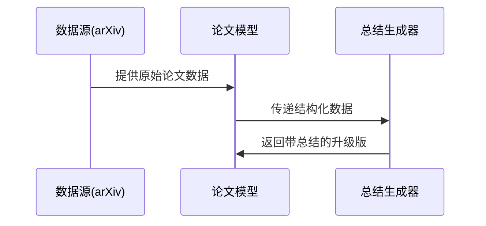

# Chapter 1: 论文数据模型


欢迎来到《每日论文》教程的第一章！就像建造一栋房子需要先设计蓝图一样，开发学术论文系统也需要先定义数据的"标准规格"——这就是我们的**论文数据模型**。

## 为什么需要数据模型？

想象你经营一家快递站，需要记录每件包裹的信息。如果有的员工写"收货人：张先生"，有的写"收件人：张三"，电脑就无法智能处理这些数据。在我们系统中：

```python
# 错误示例：混乱的数据格式
paper1 = {"标题": "深度学习研究", "作者": ["王五"]}
paper2 = {"title": "AI进展", "authors": "赵六"}
```

通过数据模型，我们就能统一语言：

```python
# 正确定义的论文数据
from daily_paper.core.models import Paper
paper = Paper(
    id="2101.12345",
    title="深度学习研究",
    authors="王五, 赵六",
    # 其他标准字段...
)
```

## 认识我们的数据模型

打开`core/models.py`文件，你会发现两个主要结构（就像快递单的两联）：

1. **基础论文模型**：记录arXiv论文的元数据
   ```python
   @dataclass
   class Paper:
       id: str       # 像快递单号一样的唯一标识
       title: str    # 论文标题
       abstract: str # 论文摘要(相当于包裹内容描述)
       # ...其他字段见文件注释
   ```

2. **带总结的扩展版**：在基础版上添加AI生成的摘要
   ```python
   @dataclass
   class PaperWithSummary(Paper):
       summary: str  # 就像快递备注栏的特别说明
   ```

## 内部工作揭秘

当系统处理一篇新论文时，数据流动就像生产线上的零件：



## 实际应用示例

假设我们要处理一篇arXiv论文：

```python
# 从arxiv获取的原始数据
raw_data = {
    "id": "2101.12345",
    "title": "关于猫是否会微积分的实验研究",
    "abstract": "本研究通过...",
    # 其他字段...
}

# 转换为标准模型
paper = Paper(**raw_data)
print(f"正在处理论文：{paper.title}")
# 输出：正在处理论文：关于猫是否会微积分的实验研究
```

## 为什么使用dataclass？

Python的`@dataclass`就像智能表格生成器：
- 自动生成`__init__`方法
- 支持类型提示
- 默认实现清晰的可读格式

```python
# 比较传统类 vs dataclass
class TraditionalPaper:          # 原始方式需要手动写很多代码
    def __init__(self, id, title...):
        self.id = id
        self.title = title
        # ...数十行重复代码

@dataclass                       # dataclass一键搞定
class ModernPaper:
    id: str
    title: str
    # ...只需声明字段
```

## 总结与下一步

今天我们学会了：
- 数据模型就像产品的"标准规格书"
- 使用`Paper`和`PaperWithSummary`两个结构
- 通过统一格式确保算子间顺畅协作

在下个章节，我们将了解如何用[DAG流水线处理器](02_dag流水线处理器_.md)把这些"标准零件"组装成完整系统！就像乐高积木需要说明书一样，数据模型需要流水线来组织运作。

---

Generated by [AI Codebase Knowledge Builder](https://github.com/The-Pocket/Tutorial-Codebase-Knowledge)