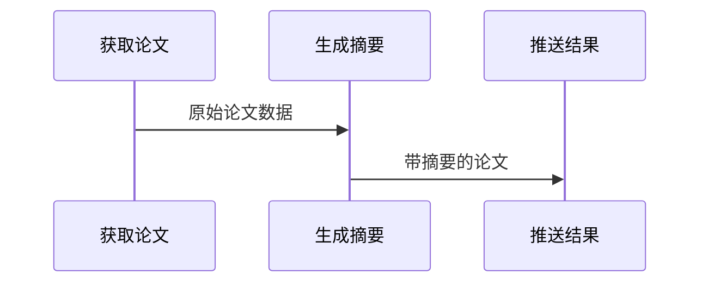

# Chapter 2: DAG流水线处理器

在[第一章](01_论文数据模型_.md)中，我们学会了如何给论文数据制定"标准规格"。这就好比准备好了所有乐高积木的零件，现在需要一份**组装说明书**——这就是我们本章要介绍的DAG流水线处理器，它能让各个处理环节像工厂流水线一样自动高效运转。

## 为什么需要流水线？

想象一家披萨店的后厨流程：
1. 准备面团（数据准备）
2. 涂抹酱料（数据预处理）
3. 添加配料（数据分析）
4. 烘烤披萨（结果生成）

如果没有合理调度：
- 可能出现"面团还没好就开始撒料"的情况
- 或让厨师闲着等上一步完成

DAG流水线处理器就是我们的"智能厨房调度系统"，它能：


## 认识DAG流水线

打开`core/pipeline.py`，我们发现处理器就像乐高说明书：

```python
class DAGPipeline:
    """DAG流水线实现"""
    def __init__(self):
        self.operators = {}  # 存放所有"工序"（算子）
        self.execution_order = []  # 执行顺序表
```

### 关键概念解析
| 概念        | 类比          | 作用                          |
|-------------|---------------|------------------------------|
| 算子(Operator) | 厨房工具       | 执行具体任务(如擀面杖/烤箱)   |
| 依赖(Dependency)| 工序先后关系   | 确保先和面再烘烤              |
| 执行层级(Layer) | 并行工作组     | 可以同时进行的步骤(如切菜和煮汤)|

## 如何使用流水线

让我们创建简单的论文处理流程：

```python
# 创建流水线实例
pipeline = DAGPipeline()

# 添加三个"工序"
pipeline.add_operator("获取论文", ArxivSource())
pipeline.add_operator("生成摘要", LLMSummarizer(), 
                    dependencies=["获取论文"])  # 需要先获取论文
pipeline.add_operator("推送结果", FeishuPusher(),
                    dependencies=["生成摘要"])  # 需要先有摘要

# 执行整个流程
await pipeline.execute()
```

执行过程就像传送带：


## 内部工作原理

当调用`execute()`时，处理器会：
1. 检查依赖关系，生成执行顺序表
2. 同一层级的算子并行执行
3. 异常时自动停止并清理资源

关键代码解析：
```python
async def execute(self, initial_data=None):
    # 按层级执行
    for layer in self.execution_order:
        tasks = []
        # 当前层级所有算子并行执行
        for op_name in layer:  
            tasks.append(self._run_operator(op_name))
        await asyncio.gather(*tasks)  # 等待整组完成
```

## 实际应用案例

假设我们要过滤感兴趣的论文：

```python
# 创建过滤流水线
filter_pipe = DAGPipeline()
filter_pipe.add_operator("数据源", ArxivSource())
filter_pipe.add_operator("过滤器", KeywordFilter(keywords=["AI"]), 
                       dependencies=["数据源"])

# 执行后会得到:
{
    "数据源": [Paper(...), Paper(...)],  # 原始数据
    "过滤器": [Paper(...)]             # 过滤后结果
}
```

## 为什么选择DAG？

- ✅ **清晰依赖管理**：确保步骤顺序正确
- ✅ **高效并行**：最大化利用CPU资源  
- ✅ **错误隔离**：单个算子失败不影响整体
- ✅ **灵活扩展**：随意增删处理环节

## 总结与下一步

今天我们掌握了：
- DAG流水线是系统的"神经系统"
- 通过算子组装实现复杂流程
- 自动处理依赖关系和并行执行

在下一章，我们将认识系统的重要数据来源——[ArXiv数据源](03_arxiv数据源_.md)，就像了解披萨店的面粉供应商一样重要！

---

Generated by [AI Codebase Knowledge Builder](https://github.com/The-Pocket/Tutorial-Codebase-Knowledge)