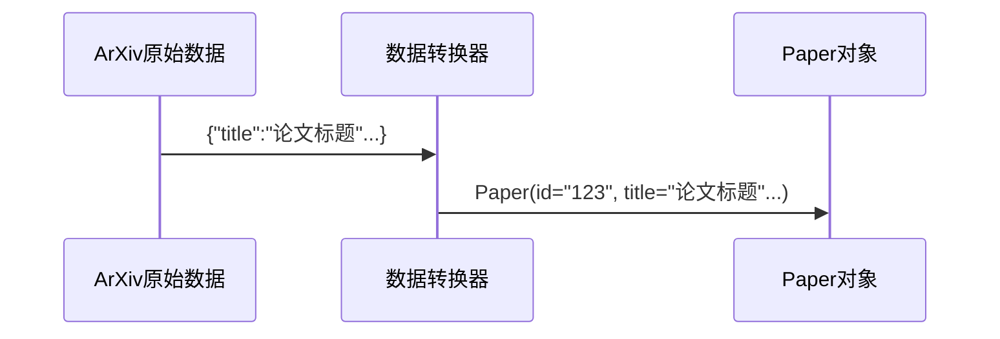

# Chapter 3: ArXiv数据源

在[第二章](02_dag流水线处理器_.md)中，我们学会了如何搭建论文处理的"流水线工厂"。现在我们需要稳定的"原材料供应商"——这就是本章的主角**ArXiv数据源**，它能从全球最大的预印本平台ArXiv为我们抓取最新学术论文。

## 为什么需要专门的数据源？

想象你是一名美食博主，每天需要：
1. 去菜市场挑选新鲜食材（获取论文）
2. 处理成标准规格的食材（统一数据格式）
3. 存放到厨房备餐区（传递给下游）

ArXiv数据源就是你的智能采购助手，可以：
- 自动按主题搜索论文（如"深度学习"）
- 处理分页和错误重试
- 返回结构化的`Paper`对象

## 初识ArXiv数据源

打开`arxiv.py`文件，核心功能就像购物清单：

```python
class ArxivSource(Operator):
    """智能论文采购员"""
    def __init__(self, topic: str | List[str]):
        self.topic = "深度学习"  # 设置采购主题
        self.max_retries = 10   # 最大重试次数
        
    async def process(self) -> List[Paper]:
        """返回标准论文数据"""
        papers = await self._fetch_from_arxiv()
        return papers
```

### 使用示例
```python
# 创建一个AI主题的采购员
procurement = ArxivSource(topic="人工智能")

# 获取最新论文
ai_papers = await procurement.process()
print(f"获取到{len(ai_papers)}篇AI论文")
```

## 核心功能详解

### 1. 主题搜索能力
支持单主题或多主题组合搜索：
```python
# 单主题搜索
single = ArxivSource(topic="机器学习")

# 多主题搜索（效果等同于"机器学习 OR 深度学习")
multi = ArxivSource(topic=["机器学习", "深度学习"])
```

### 2. 分页控制
像翻书一样获取不同页码的论文：
```python
# 从第50条开始获取100条
pager = ArxivSource(
    topic="神经网络",
    search_offset=50,  # 起始位置
    search_limit=100   # 获取数量
)
```

### 3. 数据标准化
将原始数据转换为标准`Paper`对象：


## 实战操作指南

### 基础使用三步走
1. **创建采购员**：明确需要的论文主题
   ```python
   buyer = ArxivSource(topic="计算机视觉")
   ```
   
2. **获取数据**：支持批量或流式获取
   ```python
   # 批量获取（适合少量数据）
   papers = await buyer.process()
   
   # 流式获取（适合大数据量）
   async for paper in buyer.stream_process():
       print(paper.title)
   ```

3. **异常处理**：自动重试机制
   ```python
   buyer = ArxivSource(
       topic="自然语言处理",
       should_retry_when_empty=True  # 空结果时自动重试
   )
   ```

### 工作流集成
与[DAG流水线处理器](02_dag流水线处理器_.md)配合使用：
```python
from daily_paper.core.operators import ArxivSource

pipeline = DAGPipeline()
pipeline.add_operator("数据源", ArxivSource(topic="量子计算"))
# ...添加其他处理环节
```

## 内部工作原理揭秘

当调用`process()`方法时：
1. **建立连接**：创建ArXiv API客户端
   ```python
   client = arxiv.Client(num_retries=100)
   ```

2. **执行搜索**：按主题和分页查询
   ```python
   search = arxiv.Search(
       query="深度学习",
       max_results=100,
       sort_by=arxiv.SortCriterion.SubmittedDate  # 按提交日期排序
   )
   ```

3. **数据转换**：统一字段格式
   ```python
   def process_paper(result):
       return Paper(
           id=result.get_short_id(),
           title=result.title,
           abstract=result.summary,
           # 其他字段...
       )
   ```

## 为什么选择ArXiv？

- 🌍 **全球最大**：覆盖所有学科的预印本论文
- ⚡ **即时更新**：比正式期刊更快获取最新研究
- 🔍 **精确搜索**：支持高级检索语法
- 📦 **规范数据**：提供结构化元数据

## 总结与下一步

今天我们学会了：
- ArXiv数据源是我们的"智能论文采购员"
- 支持按主题搜索和分页控制
- 自动将原始数据转换为标准`Paper`对象

在下一章，我们将认识系统的"大脑"——[LLM摘要生成器](04_llm摘要生成器_.md)，它能把采购来的论文加工成易读的精华内容！

---

Generated by [AI Codebase Knowledge Builder](https://github.com/The-Pocket/Tutorial-Codebase-Knowledge)