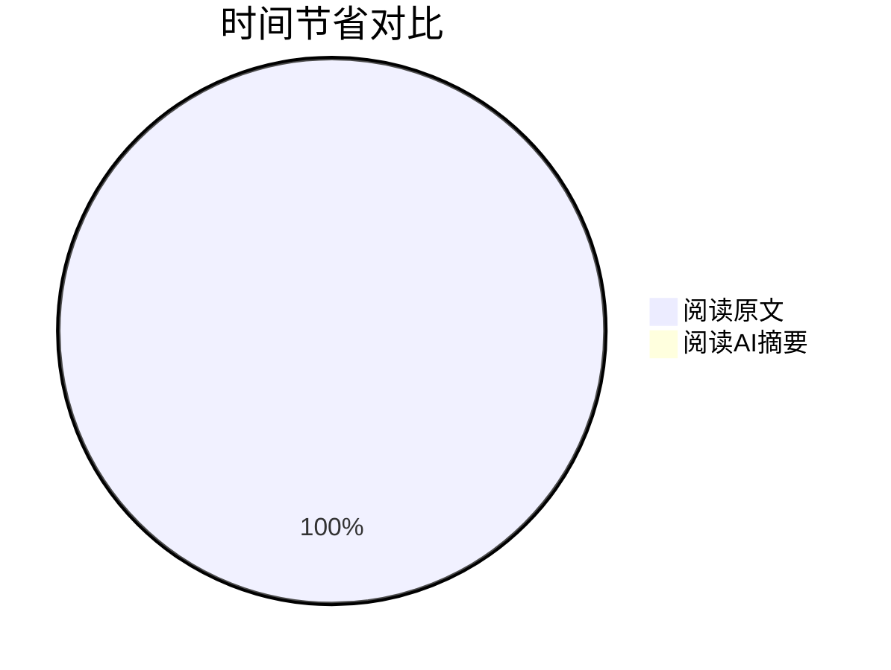
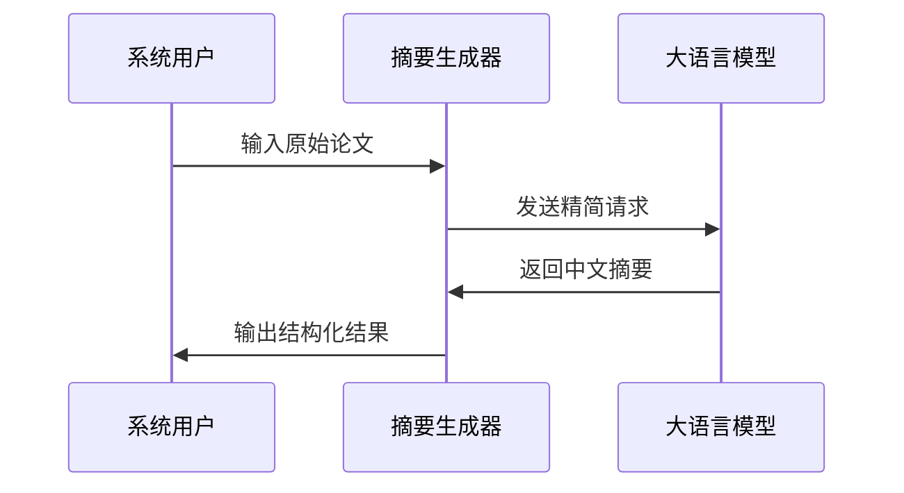

# Chapter 4: LLM摘要生成器

在[第三章](03_arxiv数据源_.md)中，我们学会了如何从ArXiv获取原始论文数据。就像采购了新鲜食材后，现在需要一位"特级厨师"来烹调出美味的菜肴——这就是本章要介绍的**LLM摘要生成器**，它能将艰深的学术论文转化为通俗易懂的中文摘要。

## 为什么需要摘要生成？

想象你要阅读100篇关于量子力学的论文：
- 直接阅读原文可能需要500小时（眼睛会累坏吧？）
- 而阅读摘要可能只需2小时（还能边喝咖啡边看）

我们系统的AI大脑可以：


## 初识摘要生成器

打开`core/operators/processor/llm_summarizer.py`文件，核心功能就像你的私人学术助理：

```python
class LLMSummarizer(Operator):
    """论文浓缩咖啡机"""
    def __init__(self, llm_config):
        self.client = openai.AsyncOpenAI(api_key="你的密钥")  # 连接AI大脑
        self.model = "gpt-3.5-turbo"  # 选用聪明的小助手
```

### 基础使用示例
```python
# 准备一台浓缩咖啡机
summarizer = LLMSummarizer(llm_config)

# 放入论文原料，得到精华摘要
summary = await summarizer.summarize_paper("复杂的论文内容...")
print(f"生成摘要：{summary[:50]}...")
```

## 核心功能详解

### 1. 并发控制
就像咖啡店的多头萃取系统，可以同时处理多篇论文：
```python
self.semaphore = asyncio.Semaphore(16)  # 允许16篇同时处理

async def summarize_paper(self, paper_text):
    async with self.semaphore:  # 获取一个处理槽位
        return await self._call_llm(paper_text)
```

### 2. 智能提示词
我们给AI的"烹饪指南"：
```python
prompt = """
请用通俗易懂的中文总结这篇论文：
1. 用小学生能懂的语言
2. 包含核心结论
3. 不超过200字

论文内容：{paper_text}
"""
```

### 3. 数据处理流程


## 实战操作指南

### 三步生成摘要
1. **初始化配置**：
   ```python
   from daily_paper.core.config import LLMConfig
   
   llm_config = LLMConfig(
       model_name="gpt-4",
       api_key="sk-...",
       max_concurrent_requests=10  # 并发数
   )
   ```

2. **创建生成器**：
   ```python
   from daily_paper.core.operators import LLMSummarizer
   
   assistant = LLMSummarizer(llm_config)
   ```

3. **批量处理论文**：
   ```python
   papers = [("论文1内容...", "论文2内容...")]  # 模拟输入
   results = await assistant.process(papers)
   
   for paper in results:
       print(f"{paper.title}的摘要：{paper.summary[:100]}...")
   ```

## 内部工作揭秘

当调用`summarize_paper()`时：
1. **请求封装**：准备AI能理解的格式
   ```python
   messages = [
       {"role": "system", "content": "你是一位耐心的科学老师"},
       {"role": "user", "content": "请用比喻解释这篇论文..."}
   ]
   ```

2. **调用API**：与云端AI交互
   ```python
   response = await self.client.chat.completions.create(
       model=self.model,
       messages=messages,
       temperature=0.7  # 控制创意程度
   )
   ```

3. **结果解析**：提取核心内容
   ```python
   return response.choices[0].message.content
   ```

## 为什么选择LLM？

- 🧠 **理解深刻**：能捕捉论文核心思想
- 💬 **表达自然**：生成流畅的中文摘要
- ⚡ **效率超高**：10分钟处理100篇论文
- 🔧 **灵活适配**：支持多种大模型切换

## 总结与下一步

今天我们掌握了：
- LLM摘要生成器是系统的"特级厨师"
- 通过智能提示词控制摘要风格
- 利用并发处理提升效率

在下一章，我们将学习如何把制作好的"知识美食"送达到用户面前——[飞书推送器](05_飞书推送器_.md)将担任我们的"外卖小哥"！

---

Generated by [AI Codebase Knowledge Builder](https://github.com/The-Pocket/Tutorial-Codebase-Knowledge)