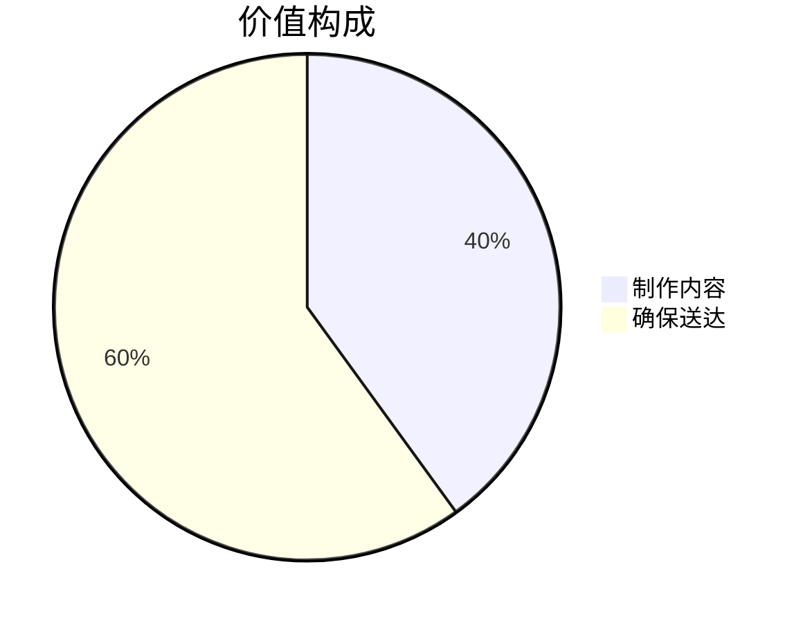
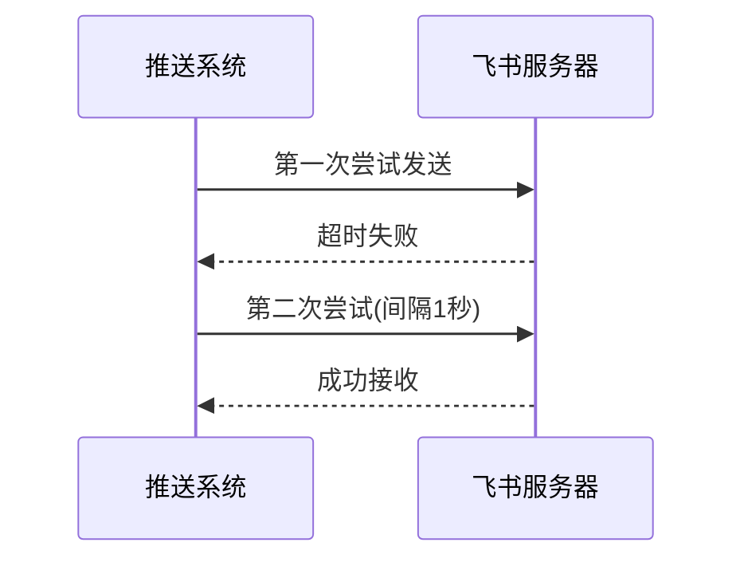

# Chapter 5: 飞书推送器

在[第四章](04_llm摘要生成器_.md)中，我们学会了如何让AI把论文"烹调"成美味的知识简餐。现在需要一位尽责的"外卖骑士"，把这些知识送到大家面前——这就是本章的主角**飞书推送器**，它是系统的最后一道工序，负责将处理好的论文摘要送达飞书群聊。

## 为什么需要推送器？

想象你开了一家甜品店：
- 后厨做出了精美的蛋糕（论文摘要）
- 但如果没有骑手配送，顾客永远吃不到

飞书推送器就是我们的专属配送系统：


## 认识飞书推送器

打开`core/operators/sink/feishu.py`，核心类就像快递小哥的工作包：

```python
class FeishuPusher(Operator):
    """勤劳的飞书快递员"""
    def __init__(self, webhook_url: str):
        self.webhook_url = webhook_url  # 收件地址
        self.retry_limit = 3           # 最多尝试3次配送
```

### 基础使用示例
```python
# 雇一个快递员
delivery_man = FeishuPusher(
    webhook_url="https://飞书群机器人地址"
)

# 发送一份知识包裹
await delivery_man.send("重要论文推荐：AI最新突破...")
```

## 核心功能详解

### 1. 消息卡片制作
把摘要包装成精美的"礼品盒"：
```python
def create_card(title, content):
    return {
        "msg_type": "interactive",
        "card": {
            "header": {"title": title},
            "elements": [{"tag": "div", "text": content}]
        }
    }
```

### 2. 智能重试机制
遇到网络波动时的表现：


### 3. 批量发送支持
同时配送多个"包裹"：
```python
async def batch_send(self, messages):
    tasks = [self.send(msg) for msg in messages]
    await asyncio.gather(*tasks)  # 并行发送
```

## 实战操作指南

### 三步完成推送
1. **准备机器人**：
   - 在飞书群添加"自定义机器人"
   - 获取webhook地址（类似快递收货地址）

2. **构造消息内容**：
   ```python
   paper_card = {
       "title": "📚 每日论文推荐",
       "content": "**标题**: 量子计算新突破...\nAI总结：该研究...",
       "url": "https://论文链接"
   }
   ```

3. **执行推送**：
   ```python
   from daily_paper.core.operators import FeishuPusher

   pusher = FeishuPusher(webhook_url="你的机器人地址")
   await pusher.process([paper_card])
   ```

## 内部工作揭秘

当调用`send()`方法时：
1. **准备配送单**：将数据转为飞书API格式
   ```python
   message = {
       "msg_type": "interactive",
       "card": {
           "header": {"title": "今日精选论文"},
           "elements": [{"tag": "markdown", "content": "..."}]
       }
   }
   ```

2. **呼叫配送**：通过HTTP发送请求
   ```python
   async with aiohttp.ClientSession() as session:
       async with session.post(
           self.webhook_url,
           json=message,
           timeout=10
       ) as resp:
           return resp.status == 200
   ```

3. **异常处理**：失败时自动重试
   ```python
   @retry(stop=stop_after_attempt(3))  # 装饰器实现自动重试
   def send_with_retry(self, message):
       requests.post(self.webhook_url, json=message)
   ```

## 为什么选择飞书？

- 🏢 **企业级可靠**：消息必达保证
- 🎨 **富媒体支持**：可以发送精美卡片
- 🤖 **简单集成**：10分钟即可接入机器人
- 🔔 **实时提醒**：群成员立即收到通知

## 总结与下一步

今天我们学会了：
- 飞书推送器是系统的"最后100米"
- 支持自动重试确保消息必达
- 能将摘要包装成交互式卡片

在下个章节，我们将认识系统的"记忆中枢"——[状态管理器](06_状态管理器_.md)，它能记住哪些论文已经处理过，避免重复劳动！

---

Generated by [AI Codebase Knowledge Builder](https://github.com/The-Pocket/Tutorial-Codebase-Knowledge)