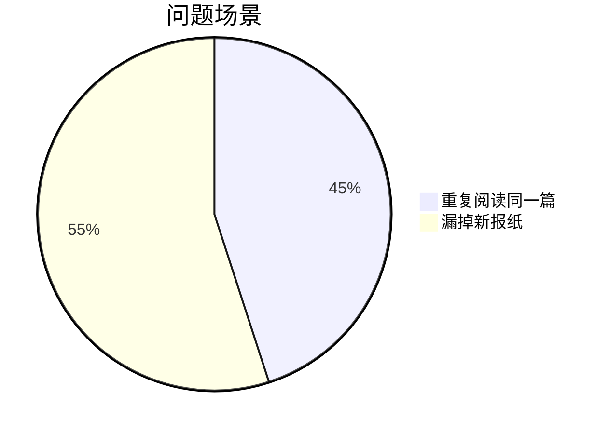
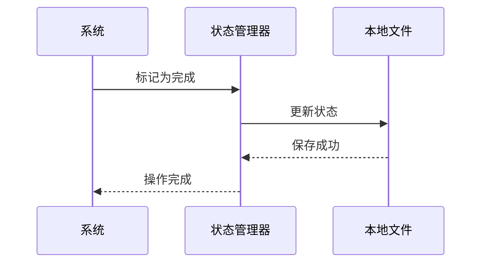
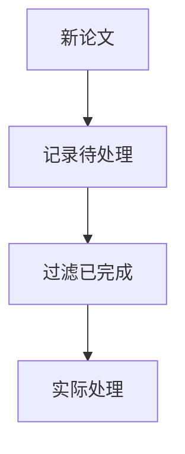

# Chapter 6: 状态管理器

在[第五章](05_飞书推送器_.md)中，我们学会了如何将论文摘要送达用户手中。就像快递公司需要记录哪些包裹已签收一样，我们的系统也需要一位"记忆管家"——**状态管理器**，它能准确记住每篇论文的处理状态，避免重复劳动。

## 为什么需要状态记忆？

想象你每天都会：
1. 从报箱取报纸（获取新论文）
2. 阅读标记重点（生成摘要）
3. 把读过的放右边（记录状态）

如果没有记录：


状态管理器的作用就是：
- ✅ 记住"哪些论文已处理"
- ✅ 筛选"待处理的新论文"
- ✅ 不同流程独立记录（如早报和晚报分开）

## 初识状态管理器

打开`core/operators/state/pending.py`，主要有两大核心：

```python
class StateManager:
    """系统的记忆便签"""
    def __init__(self, base_dir: str, namespace: str):
        self.state_file = Path(base_dir) / f"{namespace}_states.json"  # 记事本存放位置
```

### 基础使用示例
```python
# 创建一个"论文摘要"专属记事本
notebook = StateManager(base_dir="./data", namespace="paper_summary")

# 记录已处理论文
notebook.mark_as_finished(["2101.12345"])

# 检查某论文是否处理过
if notebook.is_finished("2102.23456"):
    print("这篇已经读过了~")
```

## 核心功能详解

### 1. 双状态管理
每篇论文只有两种状态：
```python
class IDState(str, Enum):
    PENDING = "pending"    # 待处理（像未拆封的信件）
    FINISHED = "finished"  # 已完成（像已归档的文件）
```

### 2. 命名空间隔离
不同流程使用独立"记事本"：
```python
# 早报流程用独立记录
morning_recorder = StateManager(base_dir="./data", namespace="morning")

# 晚报流程用另一本
evening_recorder = StateManager(base_dir="./data", namespace="evening")
```

### 3. 持久化存储
数据保存到本地文件，重启也不会丢失：


## 实战操作指南

### 典型工作流三步走
1. **初始化记录本**：
   ```python
   from daily_paper.core.operators.state import StateManager

   recorder = StateManager(
       base_dir="./data",      # 存储目录
       namespace="ai_papers"   # 记录本名称
   )
   ```

2. **批量记录状态**：
   ```python
   # 新增待处理论文
   recorder.store_pending_ids(["2301.11111", "2301.22222"])

   # 标记已完成
   recorder.mark_as_finished(["2301.11111"])
   ```

3. **查询状态**：
   ```python
   # 获取所有待处理论文
   pending = recorder.get_pending_ids()
   print(f"待处理论文：{pending}")

   # 检查单篇状态
   if recorder.is_finished("2301.22222"):
       print("这篇已处理")
   ```

## 内部工作原理

当调用`mark_as_finished()`时：
1. **加载现有记录**：读取JSON文件
   ```python
   if not self.state_file.exists():
       return {}  # 首次使用创建空记录
   with open(self.state_file, "r") as f:
       return json.load(f)
   ```

2. **更新状态字典**：
   ```python
   states[id] = "finished"  # 修改指定ID状态
   ```

3. **保存到文件**：
   ```python
   with open(self.state_file, "w") as f:
       json.dump(states, f)  # 写入更新后数据
   ```

## 与流水线配合

结合[DAG流水线处理器](02_dag流水线处理器_.md)使用：
```python
pipeline = DAGPipeline()
# 添加状态管理算子
pipeline.add_operator("记录待处理", InsertPendingIDs("./data", "ai"))
pipeline.add_operator("过滤已完成", FilterFinishedIDs("./data", "ai"))
```

处理流程示意：


## 为什么这样设计？

- 📁 **简单可靠**：文件存储无需额外服务
- 🏷️ **灵活分类**：通过命名空间隔离不同场景
- 🔄 **原子操作**：读写完整状态避免冲突
- 🚀 **高效查询**：直接从内存获取状态

## 总结与下一步

今天我们掌握了：
- 状态管理器是系统的"记忆中枢"
- 通过文件存储实现持久化记录
- 支持命名空间隔离不同流程

在下一章，我们将认识系统的基础构建块——[基础算子](07_基础算子_.md)，它们就像乐高积木的基本零件，能组合出各种强大功能！

---

Generated by [AI Codebase Knowledge Builder](https://github.com/The-Pocket/Tutorial-Codebase-Knowledge)