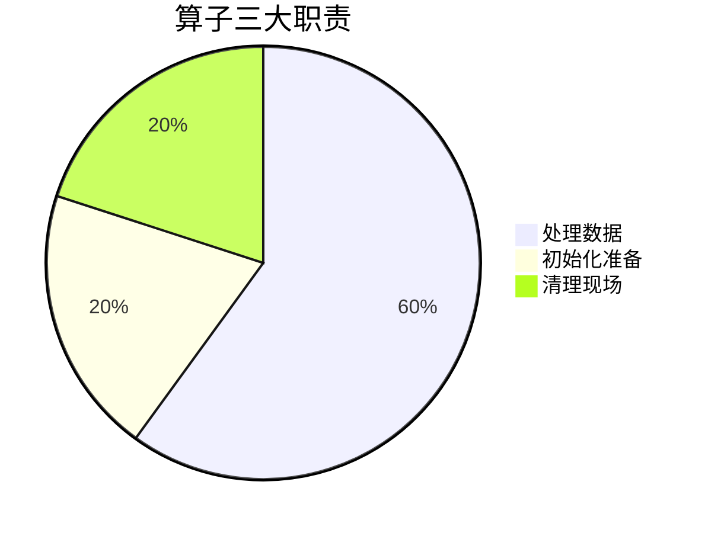
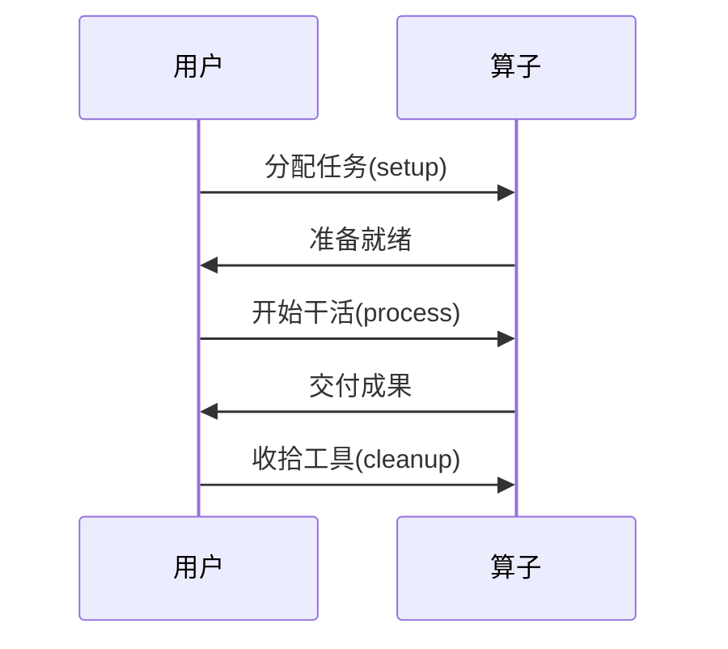

# Chapter 7: 基础算子

在[第六章](06_状态管理器_.md)中，我们认识了系统的"记忆管家"。现在让我们回到最基础的构建单元——就像乐高积木中最基础的小方块一样，**基础算子**是整个系统中最底层的"工人"，所有复杂功能都由它们组合而成。

## 为什么需要基础算子？

想象一个披萨店的厨房：
- 切菜师傅（数据准备）
- 烤炉师傅（数据处理）
- 装盒师傅（结果输出）

基础算子就是这些"专业师傅"的标准工作台，它规定了：


## 初识基础算子

打开`core/operators/base/operator.py`，可以看到这是所有算子的"身份证"：

```python
class Operator:
    """所有工人的标准化合同"""
    async def process(self, input_data):
        raise NotImplementedError("每个工人必须会干活！")  # 核心技能
    
    async def setup(self): pass  # 上班前的准备工作
    async def cleanup(self): pass  # 下班前的打扫
```

### 最简单的例子
```python
class 切菜师傅(Operator):
    async def process(self, 蔬菜):
        return 切好的蔬菜 = [蔬菜切成片]
```

## 核心概念解析

### 1. 算子状态
每个工人都有工作状态牌：
```python
class OperatorStatus(Enum):
    PENDING = "等待中"   # 正在等活儿
    RUNNING = "工作中"   # 正在切菜
    COMPLETED = "已完成" # 活儿干完了
    FAILED = "搞砸了"    # 切到手了...
```

### 2. 处理流程
标准工作三步走：


### 3. 算子节点
DAG流水线中的"工位"：
```python
@dataclass
class OperatorNode:
    operator: Operator    # 工人本体
    name: str             # 工牌名字
    dependencies: Set[str] # 需要等哪些同事先完成
```

## 如何创建自定义算子

### 基础模板
```python
from daily_paper.core.operators import Operator

class 我的算子(Operator):
    def __init__(self, 参数):
        self.工具 = 参数  # 初始化自备工具
    
    async def process(self, 输入数据):
        return 输入数据 + "处理后的结果"
```

### 完整生命周期示例
```python
class 咖啡机(Operator):
    async def setup(self):
        print("注入清水，预热机器")  # 上班准备
    
    async def process(self, 咖啡豆):
        return f"{咖啡豆}变成香浓咖啡"
    
    async def cleanup(self):
        print("清理咖啡渣，关机")  # 下班收拾
```

## 内部工作揭秘

当算子被调用时：
1. **初始化阶段**：执行setup()
   ```python
   # 在DAG流水线中调用
   await operator.setup()  # 准备原料
   ```

2. **处理阶段**：核心工作
   ```python
   try:
       result = await operator.process(data)  # 实际加工
       status = OperatorStatus.COMPLETED
   except:
       status = OperatorStatus.FAILED
   ```

3. **清理阶段**：资源释放
   ```python
   finally:
       await operator.cleanup()  # 无论如何都会执行
   ```

## 实战：构建计数算子

让我们创建一个统计论文数量的算子：
```python
class 论文计数器(Operator):
    async def process(self, 论文列表):
        return {
            "总篇数": len(论文列表),
            "最早日期": min(p.date for p in 论文列表)
        }
```

在流水线中使用：
```python
pipeline.add_operator("统计", 论文计数器())
```

## 为什么这样设计？

- 🧩 **统一接口**：所有算子兼容DAG调度
- ⏱️ **生命周期管理**：规范资源使用
- 🔄 **幂等性**：相同输入永远得到相同输出
- 🧑‍🔧 **可扩展**：轻松添加新功能算子

## 总结与下一步

今天我们掌握了：
- 基础算子是系统的"标准工人"
- 必须实现process()核心方法
- 通过setup()和cleanup()管理资源
- 在DAG中作为节点运作

在下一章，我们将了解系统的"文件柜"——[本地存储组件](08_本地存储组件_.md)，它负责安全保存所有处理结果！

---

Generated by [AI Codebase Knowledge Builder](https://github.com/The-Pocket/Tutorial-Codebase-Knowledge)