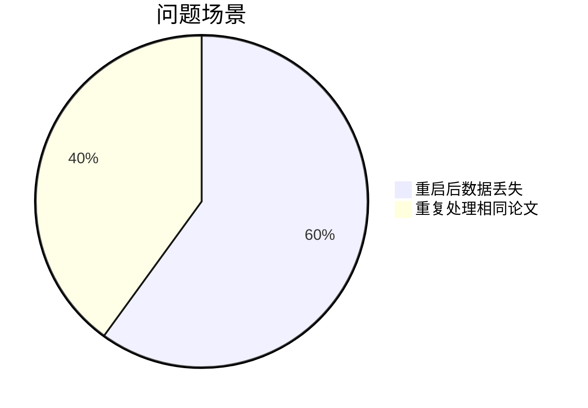
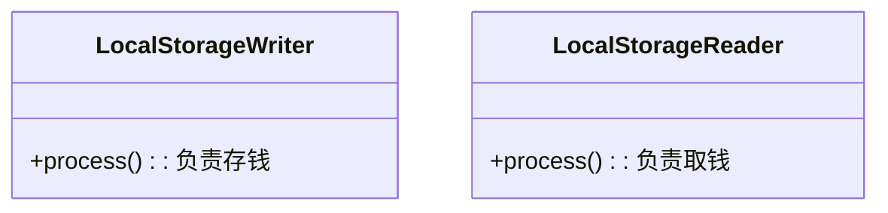

# Chapter 8: 本地存储组件

在[第七章](07_基础算子_.md)中，我们认识了系统的"基础工人"。现在需要一个安全的"文件保险柜"——**本地存储组件**，它能将所有重要数据永久保存在硬盘上，即使系统重启也不会丢失。

## 为什么需要本地存储？

想象你在经营一家图书馆：
- 新书不断购入（处理中的论文数据）
- 珍贵书籍需要永久保存（摘要、分析结果等）
- 读者随时可能借阅（后续流程需要历史数据）

如果没有存储组件：


本地存储组件就是我们的智能档案管理员：
- 📂 自动创建分类文件夹
- ✍️ 将Python数据转为JSON保存
- 🔍 支持快速检索历史记录

## 初识存储组件

打开`core/operators/storage/local_storage.py`，核心功能就像银行的保险柜系统：

```python
class LocalStorage:
    """文件保险柜基类"""
    def __init__(self, storage_dir: str, storage_namespace: str):
        self.storage_dir = Path(storage_dir)  # 金库位置
        self.storage_namespace = namespace    # 保险柜编号
```

### 基础使用示例
```python
# 开一个AI论文专用保险柜
vault = LocalStorage(storage_dir="./data", storage_namespace="ai_papers")

# 存入珍贵数据
data = {"论文ID": "2301.12345", "摘要": "关于猫的深度学习研究..."}
vault.write_storage(data)

# 随时取回
saved_data = vault.read_storage()
print(f"取回数据：{saved_data['论文ID']}")
```

## 核心功能详解

### 1. 数据读写器
保险柜的两种操作员：


### 2. 自动目录创建
首次使用时自动准备：
```python
self.storage_dir.mkdir(parents=True, exist_ok=True)  
# 如同银行自动准备空保险柜
```

### 3. 结构化存储
数据以标准格式保存：
```json
{
  "论文ID": {
    "value": "实际数据...",
    "stored_at": "2023-01-01T12:00:00"  # 存入时间戳
  }
}
```

## 实战操作指南

### 三步完成数据持久化
1. **准备存储实例**：
   ```python
   from daily_paper.core.operators.storage import LocalStorageWriter

   saver = LocalStorageWriter(
       storage_dir="./data",      # 存储目录
       storage_namespace="summaries"  # 分类名称
   )
   ```

2. **定义存储规则**：
   ```python
   def 保存规则(论文):
       return 论文.id, 论文.summary  # (键, 值)
   
   saver.key_value_getter = 保存规则
   ```

3. **执行存储操作**：
   ```python
   papers = [...]  # 待保存的论文列表
   await saver.process(papers)  # 自动存入硬盘
   ```

## 内部工作揭秘

当调用`write_storage()`时：
1. **准备数据**：将Python对象转为JSON兼容格式
   ```python
   {
       "2301.12345": {
           "value": "研究证明猫会微积分...",
           "stored_at": "2023-01-01T12:00:00"
       }
   }
   ```

2. **原子写入**：确保数据完整性
   ```mermaid
   sequenceDiagram
       participant 程序 as 主程序
       participant 存储 as 本地存储
       
       程序->>存储: 准备数据
       存储->>存储: 创建临时文件
       存储->>存储: 写入数据
       存储->>程序: 确认保存成功
   ```

3. **文件操作**：最终保存流程
   ```python
   with open("data/summaries.json", "w") as f:
       json.dump(data, f)  # 像把文件放入保险柜并上锁
   ```

## 与状态管理器配合

结合[状态管理器](06_状态管理器_.md)使用更强大：
```python
# 记录处理状态
state = StateManager("./data", "paper_status")

# 保存论文内容
storage = LocalStorageWriter("./data", "paper_content")
```

完整工作流：


## 为什么这样设计？

- 🛡️ **安全可靠**：文件操作带错误处理
- 📅 **完备记录**：自动添加时间戳
- 🗂️ **分类存储**：不同数据互不干扰
- ⚡ **快速读取**：直接内存加载常用数据

## 总结与下一步

今天我们掌握了：
- 本地存储组件是系统的"数据保险柜"
- 通过键值对形式保存结构化数据
- 自动处理JSON序列化和文件操作

恭喜完成《每日论文》所有核心组件的学习！🎉 现在你已经了解系统从数据获取到存储的完整流程，可以开始构建自己的学术助手了。如果有任何问题，欢迎查阅之前章节：  
[论文数据模型](01_论文数据模型_.md) | [DAG流水线处理器](02_dag流水线处理器_.md) | [ArXiv数据源](03_arxiv数据源_.md)

---

Generated by [AI Codebase Knowledge Builder](https://github.com/The-Pocket/Tutorial-Codebase-Knowledge)