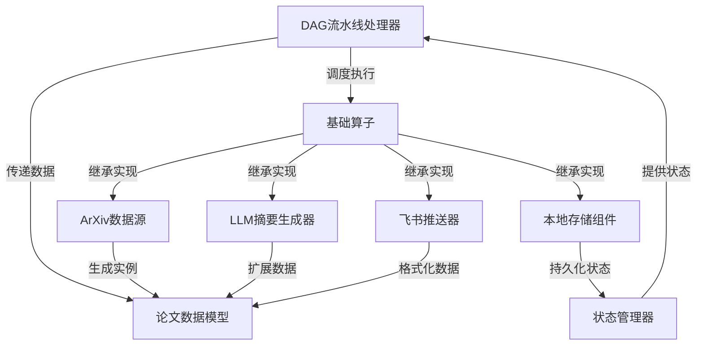

# DailyPaper

**daily_paper** 是一个自动化论文处理系统，主要用于*每日抓取*、*智能摘要*和*推送*学术论文。系统通过**DAG流水线**协调多个算子，从ArXiv获取论文数据，使用**大语言模型**生成中文摘要，并最终通过飞书推送给用户。核心功能包括*数据获取*、*状态管理*和*AI辅助分析*，帮助用户高效跟踪最新研究成果。

## 目录

1. [论文数据模型](01_论文数据模型_.md)
2. [DAG流水线处理器](02_dag流水线处理器_.md)
3. [ArXiv数据源](03_arxiv数据源_.md)
4. [LLM摘要生成器](04_llm摘要生成器_.md)
5. [飞书推送器](05_飞书推送器_.md)
6. [状态管理器](06_状态管理器_.md)
7. [基础算子](07_基础算子_.md)
8. [本地存储组件](08_本地存储组件_.md)

---

Generated by [AI Codebase Knowledge Builder](https://github.com/The-Pocket/Tutorial-Codebase-Knowledge)