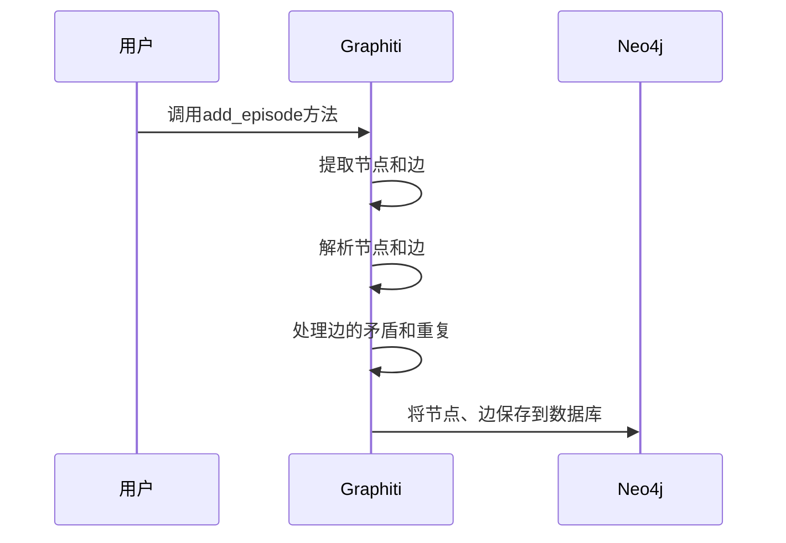

# Chapter 1: 知识图谱框架Graphiti

在当今的人工智能领域，动态环境中的信息处理变得越来越重要。例如，想象一个智能客服系统，它需要不断处理用户的实时交互信息，包括文本对话、订单数据等。这些信息不断变化，而且相互关联，传统的处理方式难以有效应对。知识图谱框架Graphiti就像是一把神奇的钥匙，专门为解决这类问题而生。

Graphiti是一个用于构建和查询时态感知知识图谱的框架，专为动态环境中的AI代理设计。它就像一个智能的信息收纳盒，能把各种信息（如用户交互、企业数据等）整理成有序的知识网络，方便AI代理随时查询和使用。

## 一、Graphiti如何解决问题
假设我们要构建一个智能客服助手，它需要理解用户不断变化的需求和历史交互信息。Graphiti可以将每一次用户与客服的对话作为一个"episode"（片段），从中提取关键信息，比如用户提到的产品名称（实体）、对产品的评价（关系）等，然后把这些信息整理成一个知识图谱。这样，当新的问题出现时，客服助手可以快速从知识图谱中找到相关信息，提供准确的回答。

## 二、关键概念
### （一）知识图谱
知识图谱就像是一张巨大的关系网，由节点和边组成。节点可以是各种实体，比如上面提到的用户、产品；边则表示实体之间的关系，如"喜欢""购买"等。例如，"用户A喜欢产品B"，这里"用户A"和"产品B"是节点，"喜欢"就是连接它们的边。

### （二）时态感知
Graphiti的时态感知特性，就好比给知识图谱加上了时间的维度。它不仅能记录事件什么时候发生，还能记录什么时候被系统摄入。这意味着我们可以查询某个特定时间点的知识图谱状态，比如昨天用户对产品的反馈，而不会受到今天新信息的干扰。

## 三、使用Graphiti解决智能客服用例
### （一）安装Graphiti
要使用Graphiti，首先需要安装它。Graphiti有一些依赖项：
 - Python 3.10或更高版本
 - Neo4j 5.26或更高版本（用作嵌入存储后端）
 - OpenAI API密钥（用于大语言模型推理和嵌入）

安装命令如下：
```bash
pip install graphiti-core
```
如果你想安装可选的大语言模型提供程序，可以使用以下命令：
```bash
# 安装支持Anthropic的版本
pip install graphiti-core[anthropic]
```
解释：上述命令使用`pip`工具安装`graphiti-core`库，如果你有特定大语言模型的需求，比如Anthropic，就在安装时指定相应的扩展。

### （二）简单示例代码
下面是一个简单的使用Graphiti的代码示例，展示如何连接到Neo4j数据库并添加一个episode：
```python
from graphiti_core import Graphiti
from datetime import datetime

# 初始化Graphiti实例，连接到Neo4j数据库
graphiti = Graphiti(
    "bolt://localhost:7687",
    "neo4j",
    "password"
)

# 定义一个episode的信息
name = "用户与客服的对话1"
episode_body = "用户询问产品的价格"
source_description = "用户咨询"
reference_time = datetime.now()

# 添加episode
graphiti.add_episode(
    name,
    episode_body,
    source_description,
    reference_time
)
```
解释：首先导入`Graphiti`类，然后创建一个`Graphiti`实例，传入Neo4j数据库的连接信息。接着定义一个episode的各项信息，最后调用`add_episode`方法将这个episode添加到知识图谱中。

## 四、Graphiti内部实现
### （一）非代码流程
当我们调用`add_episode`方法时，Graphiti内部大致会经历以下步骤：

解释：用户调用`add_episode`方法后，Graphiti先从传入的episode信息中提取出可能的节点和边，然后对这些节点和边进行解析，比如确定它们在知识图谱中的准确位置。接着处理可能出现的边的矛盾（比如用户之前说喜欢产品，现在又说不喜欢）和重复问题。最后将处理好的节点和边保存到Neo4j数据库中。

### （二）代码层面实现
在`graphiti_core/graphiti.py`文件中，`add_episode`方法的实现涉及多个步骤。以下是简化后的关键代码部分：
```python
async def add_episode(
    self,
    name: str,
    episode_body: str,
    source_description: str,
    reference_time: datetime,
    # 省略其他参数
):
    try:
        # 验证实体类型
        validate_entity_types(entity_types)

        # 获取之前的episode
        previous_episodes = await self.retrieve_episodes(
            reference_time,
            # 省略其他参数
        )

        # 创建或获取当前episode
        episode = EpisodicNode(
            name=name,
            # 省略其他参数
        )

        # 提取节点
        extracted_nodes = await extract_nodes(
            self.clients, episode, previous_episodes, entity_types
        )

        # 提取边并解析节点
        (nodes, uuid_map), extracted_edges = await semaphore_gather(
            resolve_extracted_nodes(
                self.clients,
                extracted_nodes,
                episode,
                previous_episodes,
                entity_types,
            ),
            extract_edges(self.clients, episode, extracted_nodes, previous_episodes, group_id),
        )

        # 处理边的指针
        extracted_edges_with_resolved_pointers = resolve_edge_pointers(
            extracted_edges, uuid_map
        )

        # 处理边的矛盾和重复
        resolved_edges, invalidated_edges = await resolve_extracted_edges(
            self.clients,
            extracted_edges_with_resolved_pointers,
            episode,
            previous_episodes,
        )

        # 构建episodic边
        episodic_edges = build_episodic_edges(nodes, episode, now)

        # 将节点、边保存到数据库
        await add_nodes_and_edges_bulk(
            self.driver, [episode], episodic_edges, nodes, entity_edges
        )

        return AddEpisodeResults(episode=episode, nodes=nodes, edges=entity_edges)
    except Exception as e:
        raise e
```
解释：这段代码首先验证实体类型，然后获取之前的episode作为上下文。接着创建或获取当前要添加的episode，并从episode中提取节点和边。之后对节点和边进行解析、处理指针、处理矛盾和重复等操作。最后将episode、节点和边批量保存到数据库中。

## 五、总结与展望
在本章中，我们了解到Graphiti是一个强大的知识图谱框架，它能帮助我们在动态环境中有效地处理和管理信息，就像为智能客服助手搭建了一个聪明的"大脑"。通过学习安装、简单使用以及内部实现原理，我们对Graphiti有了初步的认识。

下一章，我们将深入探讨Graphiti中的[节点（Nodes）](02_节点_nodes__.md)，了解这些知识图谱的基本组成单元是如何定义和使用的。 

---

Generated by [AI Codebase Knowledge Builder](https://github.com/The-Pocket/Tutorial-Codebase-Knowledge)