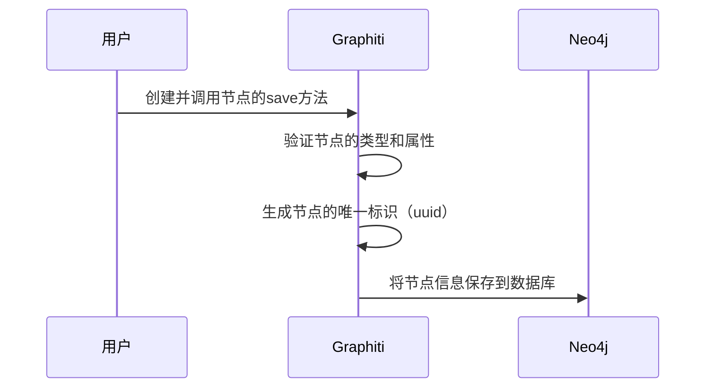

# Chapter 2: 节点（Nodes）

在上一章，我们了解了[知识图谱框架Graphiti](01_知识图谱框架graphiti_.md)，知道它是一个强大的用于构建和查询时态感知知识图谱的框架，能够帮助我们在动态环境中有效处理和管理信息。接下来，我们将深入探讨Graphiti中的“节点（Nodes）”，它是知识图谱的基本组成单元。

在现实生活中，我们常常需要处理各种各样的实体信息。比如，在一个社交网络中，每个用户就是一个实体，他们有自己的属性，如姓名、年龄、兴趣爱好等，并且用户之间还存在着各种关系，比如好友关系、共同兴趣关系等。在Graphiti中，节点就像是这些实体在知识图谱中的数字化“化身”，代表着人、物、概念等各种实体。就好比知识网络中的一个个“站点”，每个站点都承载着自己独特的属性，并且与其他站点相互关联。例如“张三”这个节点，可能关联着“职业”“爱好”等信息。

## 节点在Graphiti中的关键概念
### 节点类型
在Graphiti中，节点主要分为以下几种类型：
 - **EpisodicNode（事件节点）**：可以理解为记录某个特定事件或交互的节点。比如用户与客服的一次对话，就可以作为一个EpisodicNode。它包含了对话的内容、来源描述、有效时间等信息。
 - **EntityNode（实体节点）**：代表具体的实体，像前面提到的“张三”就是一个实体节点。它有名称、名称嵌入（用于更方便地进行数据处理和分析）、摘要以及一些额外的属性。
 - **CommunityNode（社区节点）**：可以看作是一组相关实体的集合。比如一个兴趣小组，这个小组作为一个整体就是一个CommunityNode，它有自己的名称、名称嵌入和摘要。

### 节点的属性
每个节点都有一些基本属性：
 - **uuid**：类似于每个人的身份证号码，是节点在知识图谱中的唯一标识。
 - **name**：节点的名称，方便我们识别和理解这个节点代表的是什么。
 - **group_id**：可以理解为节点所属的“分组”，比如不同项目、不同领域的数据可以通过group_id进行区分。
 - **created_at**：记录节点创建的时间。

## 使用节点解决示例用例
假设我们要构建一个简单的人物关系知识图谱，以“张三”为例，展示如何在Graphiti中创建和使用节点。

### 创建节点
```python
from graphiti_core import Graphiti
from graphiti_core.nodes import EntityNode
from datetime import datetime

# 初始化Graphiti实例，连接到Neo4j数据库
graphiti = Graphiti(
    "bolt://localhost:7687",
    "neo4j",
    "password"
)

# 创建“张三”这个实体节点
zhang_san = EntityNode(
    name="张三",
    group_id="people_group",
    summary="一个普通人物",
    attributes={"age": 30, "occupation": "工程师"}
)
```
解释：上述代码首先导入需要的模块和类。然后创建了一个Graphiti实例，连接到本地的Neo4j数据库。接着定义了一个名为“张三”的实体节点，指定了所属分组、摘要以及一些属性。

### 保存节点到知识图谱
```python
# 保存“张三”节点到知识图谱
await zhang_san.save(graphiti.driver)
```
解释：这行代码调用了`zhang_san`节点的`save`方法，将这个节点保存到Graphiti所连接的知识图谱数据库（这里是Neo4j）中。

## 节点的内部实现
### 非代码流程
当我们创建并保存一个节点时，Graphiti内部大致会经历以下步骤：

解释：用户创建节点并调用`save`方法后，Graphiti首先会检查节点的类型和属性是否正确。然后为节点生成唯一标识`uuid`。最后将节点的所有信息保存到Neo4j数据库中。

### 代码层面实现
以`EntityNode`为例，在`graphiti_core/nodes.py`文件中，`save`方法的实现如下：
```python
async def save(self, driver: AsyncDriver):
    entity_data: dict[str, Any] = {
        'uuid': self.uuid,
        'name': self.name,
        'name_embedding': self.name_embedding,
        'group_id': self.group_id,
       'summary': self.summary,
        'created_at': self.created_at,
    }
    entity_data.update(self.attributes or {})

    result = await driver.execute_query(
        ENTITY_NODE_SAVE,
        labels=self.labels + ['Entity'],
        entity_data=entity_data,
        database_=DEFAULT_DATABASE,
    )
    logger.debug(f'Saved Node to neo4j: {self.uuid}')
    return result
```
解释：这段代码首先将节点的各种属性整理成一个字典`entity_data`，并更新节点的额外属性。然后通过`driver.execute_query`方法执行数据库查询，将节点信息保存到Neo4j数据库中，`ENTITY_NODE_SAVE`是预定义的保存实体节点的查询语句。

## 总结与展望
在本章中，我们学习了Graphiti中节点的概念、类型、属性以及如何创建和保存节点，了解到节点作为知识图谱的基本组成单元，承载着丰富的实体信息。通过实际的代码示例，我们掌握了在Graphiti中操作节点的基本方法。

下一章，我们将继续探索Graphiti中的[边（Edges）](03_边_edges__.md)，了解实体之间的关系是如何在知识图谱中表示和管理的。 

---

Generated by [AI Codebase Knowledge Builder](https://github.com/The-Pocket/Tutorial-Codebase-Knowledge)