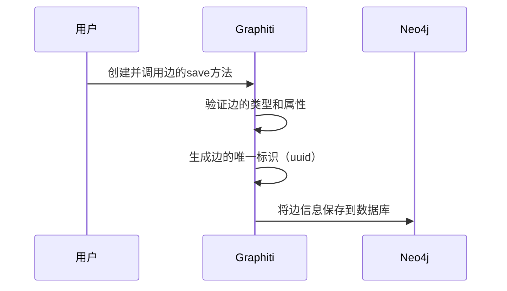

# Chapter 3: 边（Edges）

在上一章，我们深入了解了Graphiti中的[节点（Nodes）](02_节点_nodes__.md)，知道节点是知识图谱的基本组成单元，代表着各种实体。而本章我们要探讨的"边（Edges）"，则是连接这些实体的"桥梁"，用于表示节点之间的关系。

想象一下，在一个人物关系的知识图谱中，我们有"张三"和"篮球"两个节点，若我们想表达"张三喜欢篮球"这个信息，就需要一条"喜欢"的边来连接这两个节点。这就是边在知识图谱中的作用，它让各个孤立的节点产生联系，从而构成一个完整的知识网络。

## 边的关键概念
在Graphiti中，边主要分为以下几种类型：
- **EpisodicEdge（事件边）**：可以理解为记录某个特定事件或交互中，事件节点与实体节点之间关系的边。比如在用户与客服的一次对话这个事件节点中，若提到了某个产品实体，那么连接这个对话事件节点和产品实体节点的边就是EpisodicEdge。
- **EntityEdge（实体边）**：用于表示实体节点之间的关系。例如"张三"这个实体节点和"李四"这个实体节点之间，如果存在"朋友"关系，那么这条连接他们的"朋友"边就是EntityEdge。它包含关系名称（如"朋友"）、代表这条边及所连接节点的事实描述（如"张三和李四是朋友"）等信息。
- **CommunityEdge（社区边）**：表示社区节点与实体节点或其他社区节点之间的关系。比如一个篮球爱好者社区（社区节点），其中包含"张三"这个成员（实体节点），连接这个社区节点和"张三"实体节点的边就是CommunityEdge。

## 使用边解决示例用例
假设我们继续构建之前的人物关系知识图谱，现在要表示"张三喜欢篮球"这个关系。

### 创建边
```python
from graphiti_core import Graphiti
from graphiti_core.edges import EntityEdge
from datetime import datetime

# 初始化Graphiti实例，连接到Neo4j数据库
graphiti = Graphiti(
    "bolt://localhost:7687",
    "neo4j",
    "password"
)

# 假设之前已创建"张三"和"篮球"的实体节点，这里获取它们的uuid
zhang_san_uuid = "123e4567-e89b-12d3-a456-426614174000"
basketball_uuid = "123e4567-e89b-12d3-a456-426614174001"

# 创建"喜欢"这条实体边
like_edge = EntityEdge(
    source_node_uuid=zhang_san_uuid,
    target_node_uuid=basketball_uuid,
    name="喜欢",
    fact="张三喜欢篮球",
    group_id="people_sports_group",
    created_at=datetime.now()
)
```
解释：上述代码首先导入必要的模块和类，创建Graphiti实例连接到数据库。然后假设已有"张三"和"篮球"实体节点并获取其uuid，接着创建了一条表示"喜欢"关系的实体边，指定了边的源节点uuid、目标节点uuid、关系名称、事实描述、所属分组及创建时间。

### 保存边到知识图谱
```python
# 保存"喜欢"边到知识图谱
await like_edge.save(graphiti.driver)
```
解释：这行代码调用`like_edge`边的`save`方法，将这条边保存到Graphiti所连接的知识图谱数据库（这里是Neo4j）中。

## 边的内部实现
### 非代码流程
当我们创建并保存一条边时，Graphiti内部大致会经历以下步骤：

解释：用户创建边并调用`save`方法后，Graphiti首先会检查边的类型和属性是否正确。然后为边生成唯一标识`uuid`。最后将边的所有信息保存到Neo4j数据库中。

### 代码层面实现
以`EntityEdge`为例，在`graphiti_core/edges.py`文件中，`save`方法的实现如下：
```python
async def save(self, driver: AsyncDriver):
    result = await driver.execute_query(
        ENTITY_EDGE_SAVE,
        source_uuid=self.source_node_uuid,
        target_uuid=self.target_node_uuid,
        uuid=self.uuid,
        name=self.name,
        group_id=self.group_id,
        fact=self.fact,
        fact_embedding=self.fact_embedding,
        episodes=self.episodes,
        created_at=self.created_at,
        expired_at=self.expired_at,
        valid_at=self.valid_at,
        invalid_at=self.invalid_at,
        database_=DEFAULT_DATABASE,
    )

    logger.debug(f'Saved edge to neo4j: {self.uuid}')

    return result
```
解释：这段代码通过`driver.execute_query`方法执行数据库查询，将边的各种信息（如源节点uuid、目标节点uuid、关系名称、事实描述等）保存到Neo4j数据库中，`ENTITY_EDGE_SAVE`是预定义的保存实体边的查询语句。

在本章中，我们学习了Graphiti中边的概念、类型，以及如何创建和保存边来表示节点之间的关系。边作为知识图谱中连接实体的重要部分，让知识图谱能够表达更丰富的信息。

下一章，我们将探索Graphiti中的[数据存储与索引（Data Storage and Indexing）](04_数据存储与索引_data_storage_and_indexing__.md)，了解知识图谱中的数据是如何进行存储和索引，以便高效查询和使用。 

---

Generated by [AI Codebase Knowledge Builder](https://github.com/The-Pocket/Tutorial-Codebase-Knowledge)