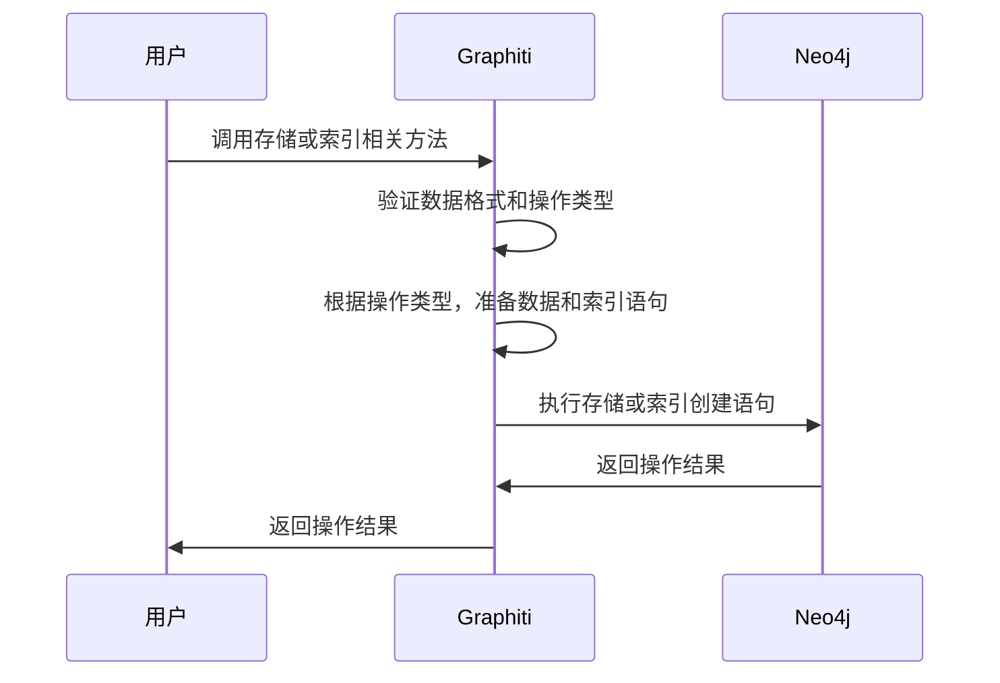

# Chapter 4: 数据存储与索引（Data Storage and Indexing）

在上一章，我们学习了Graphiti中的[边（Edges）](03_边_edges__.md)，了解到边是连接知识图谱中各个节点的"桥梁"，用于表示节点之间的关系。现在，让我们进一步探索Graphiti中的数据存储与索引，看看知识图谱中的数据是如何进行存储和索引，以便高效查询和使用。

## 数据存储与索引的重要性
想象一下，你身处一座巨大的图书馆，里面存放着海量的书籍。如果这些书籍随意摆放，那么当你想要寻找某一本特定的书时，将会耗费大量的时间和精力。但如果图书馆有一套完善的书架系统和索引目录，每本书都被有序地放置在特定位置，并且通过索引目录能够快速定位，那么找书就会变得轻松许多。

在Graphiti中，数据存储与索引就如同图书馆的书架系统和索引目录。知识图谱中的数据（节点和边所代表的信息）就像是图书馆里的书籍，我们需要将这些数据妥善地存储在Neo4j数据库中，就像把书籍放在书架上。同时，通过建立索引，我们能够优化查询性能，快速找到所需的信息，就像通过索引目录快速找到想要的书籍一样。

例如，在一个包含大量用户与客服对话记录的知识图谱中，如果没有良好的数据存储与索引，当我们想要查询某个特定用户在某段时间内的所有对话时，可能需要遍历整个数据库，效率极低。而有了合适的数据存储与索引，我们就能快速定位到相关数据，大大提高查询效率。

## 关键概念
### 数据存储
Graphiti将知识图谱的数据存储在Neo4j数据库中。Neo4j是一种图形数据库，非常适合存储和处理具有复杂关系的数据，就像知识图谱中的节点和边所构成的关系网络。Graphiti会把不同类型的节点（如[节点（Nodes）](02_节点_nodes__.md)章节中提到的EpisodicNode、EntityNode、CommunityNode）和边（如[边（Edges）](03_边_edges__.md)章节中提到的EpisodicEdge、EntityEdge、CommunityEdge）按照其属性和关系，有序地存储在Neo4j数据库中。

### 索引
索引是一种数据结构，它能够帮助我们快速定位数据库中的数据。在Graphiti中，为了优化查询性能，会针对节点和边的各种属性建立索引。比如，为节点的uuid、name、group_id等属性，以及边的uuid、name、group_id等属性建立索引。这样，当我们根据这些属性进行查询时，就可以直接通过索引快速找到对应的节点或边，而不需要遍历整个数据库。

## 使用数据存储与索引解决示例用例
假设我们有一个知识图谱，记录了用户与客服的对话，并且我们想要快速查询某个特定用户在某段时间内的所有对话。

### 创建数据存储与索引
在Graphiti中，通常不需要手动一个个地创建存储和索引，框架内部有相应的机制来处理。不过，我们可以看看如何通过代码来触发建立索引的操作。以下是简化后的代码示例：

```python
from neo4j import AsyncDriver
from graphiti_core.utils.maintenance.graph_data_operations import build_indices_and_constraints

async def create_indexes(driver: AsyncDriver):
    # 删除已存在的索引（这里假设为了演示，实际使用需谨慎）
    await build_indices_and_constraints(driver, delete_existing=True)
```

解释：这段代码导入了必要的模块，定义了一个`create_indexes`函数。函数内部调用`build_indices_and_constraints`函数，并传入`driver`对象以及`delete_existing=True`参数，表示先删除已有的索引，然后重新创建索引。

### 查询数据
假设我们已经有了存储好的数据和建立好的索引，下面是如何查询某个特定用户在某段时间内的对话的代码示例：

```python
from neo4j import AsyncDriver
from graphiti_core.utils.maintenance.graph_data_operations import retrieve_episodes
from datetime import datetime

async def query_user_conversations(driver: AsyncDriver, user_name, start_time, end_time):
    # 这里假设通过某种方式将user_name转换为对应的group_id，实际可能更复杂
    group_id = "user_group_" + user_name
    reference_time = end_time
    episodes = await retrieve_episodes(
        driver,
        reference_time,
        group_ids=[group_id]
    )
    for episode in episodes:
        if episode.created_at >= start_time:
            print(f"对话内容: {episode.content}")
```

解释：这段代码定义了`query_user_conversations`函数，用于查询特定用户在指定时间内的对话。函数接受`driver`对象、`user_name`、`start_time`和`end_time`作为参数。首先假设将`user_name`转换为对应的`group_id`，然后设置`reference_time`为`end_time`，调用`retrieve_episodes`函数获取相关的对话记录。最后遍历这些记录，打印出在指定时间范围内的对话内容。

## 内部实现
### 非代码流程
当我们在Graphiti中调用相关操作来存储数据和建立索引时，大致会经历以下步骤：

解释：用户调用相关方法后，Graphiti首先验证数据格式是否正确以及操作类型是否合法。接着根据具体操作（如存储节点、边，创建索引等）准备相应的数据和Cypher语句（Neo4j数据库的查询语言）。然后将这些语句发送给Neo4j数据库执行，Neo4j执行完毕后返回操作结果给Graphiti，Graphiti再将结果返回给用户。

### 代码层面实现
以`build_indices_and_constraints`函数为例，在`graphiti_core/utils/maintenance/graph_data_operations.py`文件中，其实现如下：

```python
async def build_indices_and_constraints(driver: AsyncDriver, delete_existing: bool = False):
    if delete_existing:
        records, _, _ = await driver.execute_query(
            """
        SHOW INDEXES YIELD name
        """,
            database_=DEFAULT_DATABASE,
        )
        index_names = [record['name'] for record in records]
        await semaphore_gather(
            *[
                driver.execute_query(
                    """DROP INDEX $name""",
                    name=name,
                    database_=DEFAULT_DATABASE,
                )
                for name in index_names
            ]
        )

    range_indices: list[LiteralString] = [
        'CREATE INDEX entity_uuid IF NOT EXISTS FOR (n:Entity) ON (n.uuid)',
        # 省略其他索引创建语句
    ]

    fulltext_indices: list[LiteralString] = [
        """CREATE FULLTEXT INDEX episode_content IF NOT EXISTS 
        FOR (e:Episodic) ON EACH [e.content, e.source, e.source_description, e.group_id]""",
        # 省略其他全文索引创建语句
    ]

    index_queries: list[LiteralString] = range_indices + fulltext_indices

    await semaphore_gather(
        *[
            driver.execute_query(
                query,
                database_=DEFAULT_DATABASE,
            )
            for query in index_queries
        ]
    )
```
解释：首先，如果`delete_existing`为`True`，函数会查询当前数据库中所有索引的名称，然后逐个删除这些索引。接着定义了两种类型的索引：范围索引`range_indices`和全文索引`fulltext_indices`。最后将这两种索引的创建语句合并，并通过`driver.execute_query`方法逐个执行，在Neo4j数据库中创建相应的索引。

## 总结
在本章中，我们学习了Graphiti中的数据存储与索引，了解到它就像图书馆的书架和索引目录，负责将知识图谱的数据有序存储在Neo4j数据库中，并通过建立索引优化查询性能。通过示例代码，我们看到了如何创建索引以及如何利用索引进行数据查询。同时，我们还深入了解了其内部实现的流程和关键代码。

下一章，我们将探索Graphiti中的[语言模型客户端（LLM Client）](05_语言模型客户端_llm_client__.md)，看看它如何与知识图谱相结合，为智能应用提供更强大的功能。 

---

Generated by [AI Codebase Knowledge Builder](https://github.com/The-Pocket/Tutorial-Codebase-Knowledge)