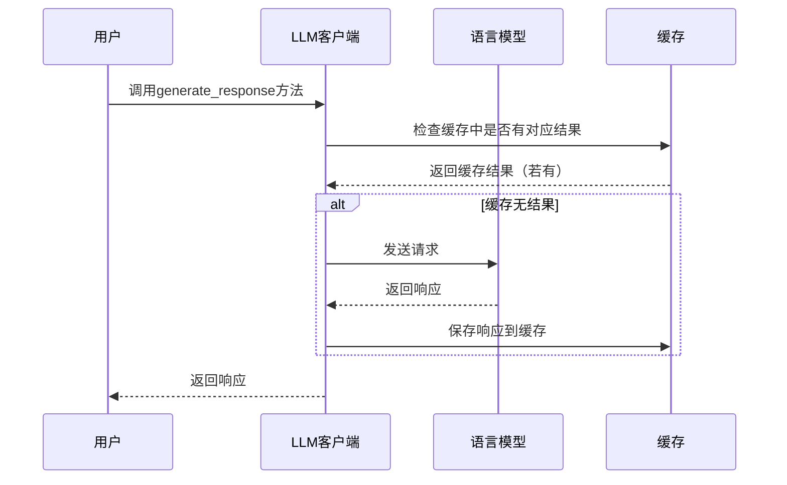

# Chapter 5: 语言模型客户端（LLM Client）

在上一章，我们学习了Graphiti中的[数据存储与索引（Data Storage and Indexing）](04_数据存储与索引_data_storage_and_indexing__.md)，了解到它能将知识图谱的数据有序存储在Neo4j数据库中，并通过建立索引优化查询性能。接下来，我们将探索Graphiti中的语言模型客户端（LLM Client），看看它如何与知识图谱相结合，为智能应用提供更强大的功能。

想象这样一个场景，有一个智能问答系统，用户可以输入自然语言问题，比如“公司去年最畅销的产品是什么？” 知识图谱虽然存储了大量关于公司产品销售的数据，但它本身难以直接理解这种自然语言的查询。这时候，语言模型客户端（LLM Client）就像一位翻译官，能把用户输入的自然语言翻译成知识图谱能理解的指令，然后从知识图谱中获取相关信息，并以自然语言的形式返回给用户。简单来说，它辅助知识图谱的构建和查询，帮助知识图谱理解自然语言并做出回应。

## 关键概念
### LLMConfig类
这个类用于配置与语言学习模型（LLM）交互所需的参数，就好比是给语言模型客户端（LLM Client）设定一些必要的 "使用规则"。它存储了访问LLM API所需的认证密钥（api_key），要使用的具体LLM模型名称（model），以及LLM API服务的基本URL（base_url）等信息。比如，如果你使用的是OpenAI的模型，那么base_url可能就是"https://api.openai.com" 。同时，还可以设置温度（temperature）和最大令牌数（max_tokens）等参数。温度这个参数影响生成文本的随机性，数值越高越随机；最大令牌数则限制了生成文本的长度。

### LLMClient类
这是一个抽象类，是与语言模型进行交互的基础类。它初始化时接受LLMConfig配置对象和一个是否启用缓存（cache）的布尔值。如果启用缓存，会在本地创建一个缓存目录（DEFAULT_CACHE_DIR为 './llm_cache'），用于存储与语言模型交互的结果。这样，当再次遇到相同的请求时，就可以直接从缓存中获取结果，提高响应速度，就像把经常用的东西放在伸手就能拿到的地方。

## 使用语言模型客户端解决示例用例
假设我们已经搭建好了知识图谱，现在要实现一个简单的自然语言查询功能，比如查询 "公司去年最畅销的产品是什么？"

### 配置LLMClient
```python
from graphiti_core.llm_client.config import LLMConfig
from graphiti_core.llm_client.client import LLMClient

# 配置LLMConfig
config = LLMConfig(
    api_key="your_api_key",
    model="gpt-3.5-turbo",
    base_url="https://api.openai.com"
)

# 初始化LLMClient
llm_client = LLMClient(config, cache=True)
```
解释：首先从`graphiti_core.llm_client.config`导入`LLMConfig`类，从`graphiti_core.llm_client.client`导入`LLMClient`类。然后创建`LLMConfig`对象，设置好api_key、model和base_url。最后用这个配置对象初始化`LLMClient`，并启用缓存。

### 生成响应
```python
from graphiti_core.prompts.models import Message

# 构建消息列表
messages = [
    Message(role="user", content="公司去年最畅销的产品是什么？")
]

# 获取响应
response = await llm_client.generate_response(messages)
print(response)
```
解释：从`graphiti_core.prompts.models`导入`Message`类，构建一个消息列表，其中包含用户的问题。然后调用`llm_client`的`generate_response`方法获取语言模型的响应，并打印出来。这里的响应会是语言模型根据问题生成的答案，比如"公司去年最畅销的产品是XX型号的手机"。

## 内部实现
### 非代码流程

解释：当用户调用`generate_response`方法时，LLM客户端首先会检查缓存中是否有对应的结果。如果有，就直接从缓存中返回结果。如果缓存中没有，LLM客户端会向语言模型发送请求，语言模型返回响应后，LLM客户端将响应保存到缓存中，最后返回给用户。

### 代码层面实现
以`LLMClient`类中的`generate_response`方法为例，在`graphiti_core/llm_client/client.py`文件中，其部分关键代码如下：
```python
async def generate_response(
    self,
    messages: list[Message],
    response_model: type[BaseModel] | None = None,
    max_tokens: int | None = None,
):
    if max_tokens is None:
        max_tokens = self.max_tokens

    if response_model is not None:
        serialized_model = json.dumps(response_model.model_json_schema())
        messages[
            -1
        ].content += (
            f'\n\nRespond with a JSON object in the following format:\n\n{serialized_model}'
        )

    messages[0].content += MULTILINGUAL_EXTRACTION_RESPONSES

    if self.cache_enabled and self.cache_dir is not None:
        cache_key = self._get_cache_key(messages)
        cached_response = self.cache_dir.get(cache_key)
        if cached_response is not None:
            logger.debug(f'Cache hit for {cache_key}')
            return cached_response

    for message in messages:
        message.content = self._clean_input(message.content)

    response = await self._generate_response_with_retry(messages, response_model, max_tokens)

    if self.cache_enabled and self.cache_dir is not None:
        cache_key = self._get_cache_key(messages)
        self.cache_dir.set(cache_key, response)

    return response
```
解释：首先，如果没有传入`max_tokens`，则使用默认的最大令牌数。如果有`response_model`，会在最后一条消息的内容中添加要求以特定JSON格式响应的说明。同时，给第一条消息的内容添加多语言提取的说明。然后检查缓存，如果缓存中有对应结果则直接返回。接着清理消息内容中的无效字符，再调用`_generate_response_with_retry`方法获取响应，并将响应保存到缓存（如果缓存启用），最后返回响应。

在本章中，我们学习了Graphiti中的语言模型客户端（LLM Client），了解到它能作为知识图谱和自然语言之间的桥梁，辅助知识图谱理解自然语言查询并做出回应。通过配置`LLMConfig`和使用`LLMClient`，我们实现了简单的自然语言查询功能，并深入了解了其内部实现。下一章，我们将探索Graphiti中的[嵌入客户端（Embedder Client）](06_嵌入客户端_embedder_client__.md)，看看它在知识图谱中扮演着怎样的角色。 

---

Generated by [AI Codebase Knowledge Builder](https://github.com/The-Pocket/Tutorial-Codebase-Knowledge)