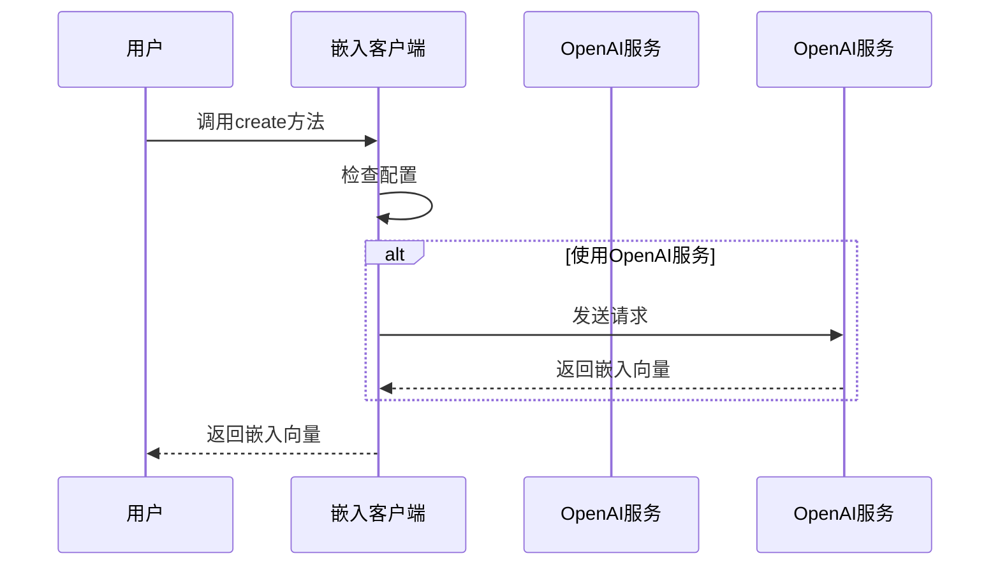

# Chapter 6: 嵌入客户端（Embedder Client）

在上一章，我们探索了Graphiti中的[语言模型客户端（LLM Client）](05_语言模型客户端_llm_client__.md)，了解到它能辅助知识图谱理解自然语言查询并做出回应。接下来，我们将走进Graphiti的“嵌入客户端（Embedder Client）”，看看它在知识图谱中发挥着怎样的关键作用。

## 嵌入客户端解决的问题
想象你身处一个巨大的图书馆，里面有各种各样的书籍，每本书都承载着不同的知识。如果要快速找到关于“人工智能”的所有书籍，就需要一种有效的分类方式。在知识图谱中，嵌入客户端就像是这个分类助手，它为节点和边生成嵌入向量，就好比给每本书贴上独特的“语义标签”，方便系统快速找到语义相关的内容，实现知识图谱的语义搜索。

例如，在一个智能客服知识图谱中，有大量用户与客服的对话节点以及描述产品信息的节点。当用户询问“有没有类似产品A的其他产品”时，嵌入客户端生成的嵌入向量就能帮助快速找到语义相关的产品节点，提升客服效率。

## 关键概念
### EmbedderConfig类
这就像是嵌入客户端的“使用说明书”，用于配置嵌入相关的参数。`EmbedderConfig`类中有一个`embedding_dim`参数，它定义了嵌入向量的维度，默认值是`1024`，这个维度决定了嵌入向量的“长度”，就像一本书标签上包含的不同信息维度。

### EmbedderClient类
这是一个抽象类，是与嵌入操作交互的基础类。它定义了一个抽象方法`create`，用于生成嵌入向量。具体的嵌入客户端实现类会继承这个类并实现`create`方法。就像一个模具，具体的产品（实现类）按照这个模具的样子来制造。

## 使用嵌入客户端解决示例用例
假设我们有一个简单的知识图谱，里面有关于电影的节点，我们想要通过语义搜索找到相关电影。

### 配置嵌入客户端
```python
from graphiti_core.embedder.client import EmbedderConfig
# 创建嵌入配置
config = EmbedderConfig() 
```
解释：从`graphiti_core.embedder.client`导入`EmbedderConfig`类，然后创建一个`EmbedderConfig`对象，使用默认配置，也就是嵌入向量维度为`1024`。

### 使用OpenAI嵌入客户端生成嵌入向量
```python
from graphiti_core.embedder.openai import OpenAIEmbedderConfig, OpenAIEmbedder
# 配置OpenAI嵌入客户端
openai_config = OpenAIEmbedderConfig(
    api_key="your_api_key",
    embedding_model='text-embedding-3-small'
)
embedder = OpenAIEmbedder(openai_config) 
```
解释：从`graphiti_core.embedder.openai`导入`OpenAIEmbedderConfig`和`OpenAIEmbedder`类。创建`OpenAIEmbedderConfig`对象，设置`api_key`和要使用的嵌入模型`text - embedding - 3 - small`。再用这个配置对象初始化`OpenAIEmbedder`嵌入客户端。

### 生成嵌入向量
```python
movie_name = "泰坦尼克号"
embedding = await embedder.create(movie_name)
print(embedding) 
```
解释：定义一个电影名称`泰坦尼克号`，调用`embedder`的`create`方法为这个电影名称生成嵌入向量，并打印出来。这个嵌入向量就像是“泰坦尼克号”这部电影在知识图谱中的独特“语义标签”。

## 内部实现
### 非代码流程
当调用嵌入客户端生成嵌入向量时，大致流程如下：

解释：用户调用嵌入客户端的`create`方法后，嵌入客户端首先检查自身配置是否正确。如果使用的是OpenAI嵌入客户端，就会向OpenAI服务发送请求，OpenAI服务返回嵌入向量，嵌入客户端再将其返回给用户。

### 代码层面实现
以`OpenAIEmbedder`类的`create`方法为例，在`graphiti_core/embedder/openai.py`文件中：
```python
async def create(
    self, input_data: str | list[str] | Iterable[int] | Iterable[Iterable[int]]
) -> list[float]:
    result = await self.client.embeddings.create(
        input=input_data, model=self.config.embedding_model
    )
    return result.data[0].embedding[: self.config.embedding_dim]
```
解释：这个方法接受输入数据`input_data`，通过`self.client`向OpenAI服务发送创建嵌入向量的请求，使用`self.config.embedding_model`指定的模型。服务返回结果后，提取第一个嵌入向量，并截取到配置的维度`self.config.embedding_dim`后返回。

## 总结
在本章中，我们了解到嵌入客户端在知识图谱中扮演着为节点和边生成嵌入向量，实现语义搜索的重要角色。通过配置`EmbedderConfig`和使用`OpenAIEmbedder`等嵌入客户端，我们学会了如何生成嵌入向量。下一章，我们将探索Graphiti中的[MCP服务器（MCP Server）](07_mcp服务器_mcp_server__.md)，看看它在整个知识图谱框架中起到什么样的作用。 

---

Generated by [AI Codebase Knowledge Builder](https://github.com/The-Pocket/Tutorial-Codebase-Knowledge)