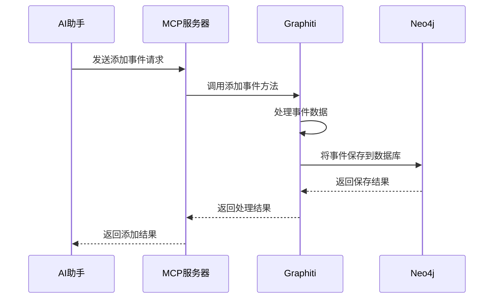

# Chapter 7: MCP服务器（MCP Server）

在上一章，我们探索了Graphiti中的[嵌入客户端（Embedder Client）](06_嵌入客户端_embedder_client__.md)，了解到它能为节点和边生成嵌入向量，实现知识图谱的语义搜索。接下来，我们将走进Graphiti的“MCP服务器（MCP Server）”，看看它在整个知识图谱框架中起到什么样的作用。

在许多人工智能应用场景中，比如智能客服系统，AI助手需要借助知识图谱中的丰富信息来准确回答用户问题。但AI助手如何与知识图谱顺畅交互呢？MCP服务器就像一座桥梁，通过Model Context Protocol协议，让AI助手能够与Graphiti的知识图谱功能进行交互。

## 关键概念
### MCP服务器
它是Graphiti的一个实验性实现，作为AI助手与知识图谱之间的沟通桥梁。通过MCP协议，AI助手可以利用Graphiti知识图谱的各种功能，如管理事件（episodes）、实体（entities），进行搜索等操作。

## 使用MCP服务器解决示例用例
假设我们有一个智能客服AI助手，它需要回答用户关于产品信息的问题，并且这些产品信息存储在Graphiti的知识图谱中。这时就可以借助MCP服务器来实现AI助手与知识图谱的交互。

### 安装与配置MCP服务器
1. **克隆Graphiti仓库**：
```bash
git clone https://github.com/getzep/graphiti.git
```
2. **安装依赖**：
确保安装了Python 3.10或更高版本，以及运行中的Neo4j数据库（5.26或更高版本），并且拥有OpenAI API key。
```bash
# 安装uv
curl -LsSf https://astral.sh/uv/install.sh | sh
# 创建虚拟环境并安装依赖
uv sync
```
3. **配置环境变量**：
在项目目录的.env文件中设置环境变量，例如：
```bash
NEO4J_URI=bolt://localhost:7687
NEO4J_USER=neo4j
NEO4J_PASSWORD=demodemo
OPENAI_API_KEY=your_api_key
```

### 运行MCP服务器
```bash
uv run graphiti_mcp_server.py
```

### 使用工具与知识图谱交互
以添加事件（episode）为例，代码如下：
```python
@mcp.tool()
async def add_episode(
    name: str,
    episode_body: str,
    group_id: str | None = None,
    source: str = 'text',
    source_description: str = '',
    uuid: str | None = None,
) -> SuccessResponse | ErrorResponse:
    # 省略部分代码
    pass
```
解释：这段代码定义了一个`add_episode`工具函数，用于向知识图谱添加事件。`name`是事件名称，`episode_body`是事件内容，`group_id`用于指定分组，`source`表示来源类型（如`text`文本、`json`等），`source_description`是来源描述，`uuid`是可选的事件唯一标识。

## 内部实现
### 非代码流程
当AI助手通过MCP服务器调用知识图谱功能，比如添加事件时，大致流程如下：

解释：AI助手向MCP服务器发送添加事件的请求，MCP服务器接收到请求后，调用Graphiti的添加事件方法。Graphiti对事件数据进行处理，然后将事件保存到Neo4j数据库。Neo4j返回保存结果给Graphiti，Graphiti再将处理结果返回给MCP服务器，最后MCP服务器把添加结果返回给AI助手。

### 代码层面实现
在`graphiti_mcp_server.py`文件中，`add_episode`函数部分关键代码如下：
```python
async def add_episode(
    # 参数定义
):
    # 映射字符串来源为EpisodeType枚举
    source_type = EpisodeType.text
    if source.lower() =='message':
        source_type = EpisodeType.message
    elif source.lower() == 'json':
        source_type = EpisodeType.json

    # 使用提供的group_id或默认的
    effective_group_id = group_id if group_id is not None else config.group_id
    group_id_str = str(effective_group_id) if effective_group_id is not None else ''

    # 定义处理事件的函数
    async def process_episode():
        # 使用所有实体类型或空字典
        entity_types = ENTITY_TYPES if config.use_custom_entities else {}
        await client.add_episode(
            # 添加事件的参数
        )
```
解释：这段代码首先将字符串形式的来源类型转换为`EpisodeType`枚举类型。然后确定要使用的`group_id`。接着定义了一个内部函数`process_episode`，在这个函数中，根据是否启用自定义实体，确定要使用的实体类型，最后调用`client.add_episode`方法来添加事件。

在本章中，我们学习了Graphiti中的MCP服务器，了解到它作为AI助手与知识图谱之间的桥梁，通过MCP协议实现两者的交互。我们学习了如何安装、配置和运行MCP服务器，以及使用其工具与知识图谱进行交互，并深入了解了其内部实现。下一章，我们将探索Graphiti中的[搜索配置（Search Configuration）](08_搜索配置_search_configuration__.md)，看看如何对知识图谱的搜索功能进行配置。 

---

Generated by [AI Codebase Knowledge Builder](https://github.com/The-Pocket/Tutorial-Codebase-Knowledge)