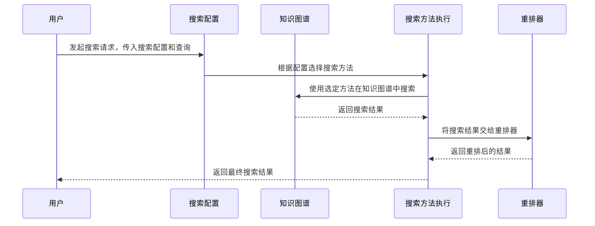

# Chapter 8: 搜索配置（Search Configuration）

在上一章，我们学习了Graphiti中的[MCP服务器（MCP Server）](07_mcp服务器_mcp_server__.md)，了解到它作为AI助手与知识图谱之间的桥梁，通过MCP协议实现两者的交互。接下来，我们将探索Graphiti中的搜索配置，看看如何对知识图谱的搜索功能进行配置，让搜索更加高效和精准。

## 搜索配置解决的问题
想象你身处一个巨大的图书馆，里面有成千上万本书籍。如果你想找到关于"人工智能发展历史"的书籍，没有一个好的搜索方式，你可能需要一本本去翻找，这将耗费大量时间。在知识图谱中，搜索配置就像是图书馆的搜索指引系统，它定义了知识图谱搜索的方式和策略，比如使用何种搜索方法、如何对结果进行重排等，帮助我们快速准确地找到所需信息。

例如，在一个智能客服知识图谱中，存储了大量用户与客服的对话记录、产品信息等。当用户询问"产品A的使用方法"时，搜索配置决定了如何在这个知识图谱中搜索相关信息，以及如何将搜索到的结果按照相关性进行排序，从而快速准确地给用户提供答案。

## 关键概念
### 搜索方法
 - **余弦相似度（cosine_similarity）**：通过计算向量之间的夹角余弦值来衡量它们的相似程度。比如在知识图谱中，每个节点或边都可以用向量表示，通过计算这些向量与查询向量的余弦相似度，来判断它们与查询的相关程度。就好比在图书馆中，通过比较书籍内容与你需求的相似程度来筛选书籍。
 - **BM25（bm25）**：一种用于信息检索的算法，它考虑了词频、文档长度等因素，能更有效地评估文档与查询的相关性。在知识图谱里，可用于判断节点或边与查询的相关度，类似于根据书籍的不同特征来评估它是否是你想要的。
 - **广度优先搜索（breadth_first_search，简称bfs）**：从起始节点开始，一层一层地搜索与它相连的节点，直到找到目标节点或搜索完整个图。在知识图谱中，当我们需要沿着节点之间的关系进行搜索时，广度优先搜索就很有用，比如从某个产品节点出发，寻找与之相关的所有节点。

### 重排器
 - **RRF（reciprocal_rank_fusion）**：一种融合多个搜索结果排名的方法，通过对不同搜索方法得到的排名进行加权融合，来得到一个综合的排名。就好像综合多位评委的打分来确定最终名次。
 - **MMR（mmr）**：最大边际相关（Maximal Marginal Relevance），在保证相关性的同时，尽量使结果多样化。比如在搜索结果中，既要有最相关的信息，也要有一些不同角度但相关的信息，避免重复。
 - **节点距离（node_distance）**：根据节点之间的距离来对搜索结果进行重排，距离起始节点越近的节点，在结果中的排名可能越靠前。
 - **事件提及（episode_mentions）**：根据事件中提及的内容来重排搜索结果，提及次数多的相关内容可能在结果中更靠前。
 - **交叉编码器（cross_encoder）**：通过一个模型对查询和文档进行联合编码，从而更准确地判断它们的相关性，以此来重排搜索结果。

### 搜索配置类
 - **EdgeSearchConfig**：用于配置边的搜索，包括使用哪些搜索方法、使用哪种重排器，以及一些相关参数，如相似度最小得分、MMR的lambda值、广度优先搜索的最大深度等。
 - **NodeSearchConfig**：类似EdgeSearchConfig，不过是用于配置节点的搜索。
 - **EpisodeSearchConfig**：专门用于配置事件（episode）的搜索。
 - **CommunitySearchConfig**：用于配置社区节点的搜索。
 - **SearchConfig**：整合了边、节点、事件和社区节点的搜索配置，还可以设置搜索结果的限制数量和重排器的最小得分。

## 使用搜索配置解决示例用例
假设我们有一个知识图谱，里面包含了产品信息以及用户与客服的对话记录。我们想要搜索与"产品A的使用方法"相关的信息。

### 配置搜索
```python
from graphiti_core.search.search_config import (
    EdgeSearchConfig,
    EdgeSearchMethod,
    EdgeReranker,
    NodeSearchConfig,
    NodeSearchMethod,
    NodeReranker,
    SearchConfig,
)

# 配置边的搜索
edge_config = EdgeSearchConfig(
    search_methods=[EdgeSearchMethod.bm25, EdgeSearchMethod.cosine_similarity],
    reranker=EdgeReranker.rrf,
)

# 配置节点的搜索
node_config = NodeSearchConfig(
    search_methods=[NodeSearchMethod.bm25, NodeSearchMethod.cosine_similarity],
    reranker=NodeReranker.rrf,
)

# 整合搜索配置
search_config = SearchConfig(
    edge_config=edge_config,
    node_config=node_config,
)
```
解释：首先导入相关的搜索配置类。然后分别配置边和节点的搜索，这里边和节点都使用BM25和余弦相似度两种搜索方法，并使用RRF重排器。最后将边和节点的搜索配置整合到`SearchConfig`中。

### 执行搜索（简化示意，实际需结合具体API）
```python
# 假设这里有一个执行搜索的函数，传入搜索配置和查询语句
results = perform_search(search_config, "产品A的使用方法")
for result in results:
    print(result)
```
解释：这里假设有一个`perform_search`函数，它接受搜索配置和查询语句作为参数，执行搜索并返回结果。然后遍历结果并打印，实际应用中`perform_search`函数会根据配置在知识图谱中进行搜索操作。

## 内部实现
### 非代码流程
当执行搜索时，大致流程如下：

解释：用户发起搜索请求，传入搜索配置和查询内容。搜索配置根据设定选择合适的搜索方法，搜索方法在知识图谱中进行搜索并得到结果。然后结果被交给重排器进行重排，重排后的结果最终返回给用户。

### 代码层面实现
以`EdgeSearchConfig`为例，在`graphiti_core/search/search_config.py`文件中，其部分代码如下：
```python
class EdgeSearchConfig(BaseModel):
    search_methods: list[EdgeSearchMethod]
    reranker: EdgeReranker = Field(default=EdgeReranker.rrf)
    sim_min_score: float = Field(default=DEFAULT_MIN_SCORE)
    mmr_lambda: float = Field(default=DEFAULT_MMR_LAMBDA)
    bfs_max_depth: int = Field(default=MAX_SEARCH_DEPTH)
```
解释：这段代码定义了`EdgeSearchConfig`类，它包含搜索方法列表`search_methods`，默认使用RRF重排器`reranker`，还有相似度最小得分`sim_min_score`、MMR的lambda值`mmr_lambda`以及广度优先搜索的最大深度`bfs_max_depth`等参数，这些参数决定了边搜索的具体行为。

## 总结
在本章中，我们学习了Graphiti中的搜索配置，了解到它如同图书馆的搜索指引系统，通过定义搜索方法和重排策略，帮助我们在知识图谱中高效准确地找到所需信息。通过实际的配置示例和对内部实现的了解，我们掌握了搜索配置的基本使用方法。下一章，我们将探索Graphiti中的[提示词库（Prompt Library）](09_提示词库_prompt_library__.md)，看看它在知识图谱应用中发挥着怎样的作用。 

---

Generated by [AI Codebase Knowledge Builder](https://github.com/The-Pocket/Tutorial-Codebase-Knowledge)