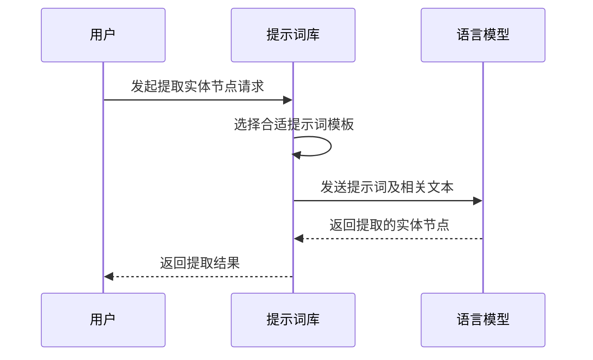

# Chapter 9: 提示词库（Prompt Library）

在上一章，我们了解了Graphiti中的[搜索配置（Search Configuration）](08_搜索配置_search_configuration__.md)，它就像图书馆的搜索指引系统，帮助我们在知识图谱中高效准确地找到所需信息。接下来，让我们一同探索Graphiti中的提示词库（Prompt Library），看看它在知识图谱应用中发挥着怎样的作用。

在实际应用中，比如智能客服场景，当用户提出问题时，语言模型需要准确理解问题意图并给出合适回答。但语言模型本身并不知道在特定场景下该如何行动，这时就需要提示词库来引导。提示词库就像是一本任务指南，包含各种用于与语言模型交互的提示词模板，指导语言模型完成特定任务。例如，在分析用户与客服对话，提取其中实体信息时，提示词库中的提示词可以引导语言模型准确识别出相关实体。

## 关键概念
提示词库主要用于存储和管理与语言模型交互的提示词模板，这些模板针对不同任务进行设计。以从文本中提取实体节点为例，提示词会引导语言模型依据特定规则，如不提取关系、时间信息等，从文本中找出重要实体。

## 使用提示词库解决示例用例
假设我们要从一段用户与客服的对话文本中提取实体节点。

### 代码示例
```python
from graphiti_core.prompts.extract_nodes import extract_text, versions
from graphiti_core.prompts.models import Message

context = {
    "episode_content": "用户：我想了解下产品A的功能。",
    "custom_prompt": "",
    "previous_episodes": []
}
messages = extract_text(context)
print(messages)
```
上述代码首先从`graphiti_core.prompts.extract_nodes`导入`extract_text`函数和`versions`，以及从`graphiti_core.prompts.models`导入`Message`类。接着定义了`context`，包含对话文本等信息。然后调用`extract_text`函数生成提示词相关的消息列表，并打印出来。通过这个提示词，语言模型将依据规则从对话文本中提取实体节点。

## 内部实现
### 非代码流程

当用户请求从文本中提取实体节点时，提示词库首先选择合适的提示词模板，然后将提示词和相关文本发送给语言模型。语言模型依据提示词进行处理，返回提取的实体节点，提示词库再将结果返回给用户。

### 代码层面实现
在`graphiti_core/prompts/extract_nodes.py`文件中，`extract_text`函数实现如下：
```python
def extract_text(context: dict[str, Any]) -> list[Message]:
    sys_prompt = """You are an AI assistant that extracts entity nodes from text. Your primary task is to identify and extract the speaker and other significant entities mentioned in the provided text."""

    user_prompt = f"""
<TEXT>
{context['episode_content']}
</TEXT>

{context['custom_prompt']}

Given the above text, extract entity nodes from the TEXT that are explicitly or implicitly mentioned:

Guidelines:
1. Extract significant entities, concepts, or actors mentioned in the conversation.
2. Avoid creating nodes for relationships or actions.
3. Avoid creating nodes for temporal information like dates, times or years (these will be added to edges later).
4. Be as explicit as possible in your node names, using full names and avoiding abbreviations.
"""
    return [
        Message(role='system', content=sys_prompt),
        Message(role='user', content=user_prompt),
    ]
```
该函数首先定义了系统提示词`sys_prompt`，表明任务是从文本中提取实体节点。然后根据传入的`context`中的对话文本等信息生成用户提示词`user_prompt`，其中包含提取实体节点的具体规则。最后返回由系统提示词和用户提示词组成的消息列表，用于引导语言模型提取实体节点。

在本章中，我们学习了Graphiti中的提示词库，了解到它如同任务指南，通过提示词模板引导语言模型完成特定任务，如从文本中提取实体节点。通过实际代码示例，我们掌握了如何使用提示词库解决具体问题，并深入了解了其内部实现。下一章，若还有后续章节，可参考[后续章节标题](后续章节文件名)继续学习Graphiti的相关知识。 

---

Generated by [AI Codebase Knowledge Builder](https://github.com/The-Pocket/Tutorial-Codebase-Knowledge)