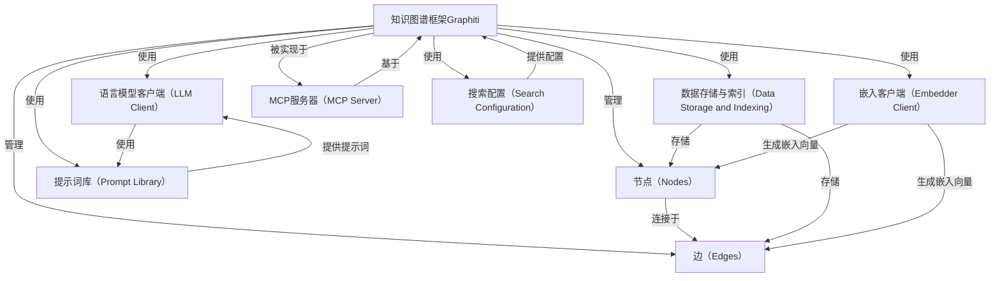

# Tutorial: graphiti

**Graphiti**是一个专为动态环境中的AI代理构建和查询时态感知知识图谱的框架。它像一个智能信息整理助手，将用户交互、企业数据等各种信息整理成有序的知识网络。通过节点代表实体，边表示实体间关系，并利用数据存储与索引来管理数据。同时借助语言模型客户端和嵌入客户端，辅助知识图谱的构建与查询。此外，还有MCP服务器实现特定交互，搜索配置定义搜索方式，提示词库指导语言模型完成任务。

**Source Repository:** [None](None)

## Chapters

1. [知识图谱框架Graphiti
](01_知识图谱框架graphiti_.md)
2. [节点（Nodes）
](02_节点_nodes__.md)
3. [边（Edges）
](03_边_edges__.md)
4. [数据存储与索引（Data Storage and Indexing）
](04_数据存储与索引_data_storage_and_indexing__.md)
5. [语言模型客户端（LLM Client）
](05_语言模型客户端_llm_client__.md)
6. [嵌入客户端（Embedder Client）
](06_嵌入客户端_embedder_client__.md)
7. [MCP服务器（MCP Server）
](07_mcp服务器_mcp_server__.md)
8. [搜索配置（Search Configuration）
](08_搜索配置_search_configuration__.md)
9. [提示词库（Prompt Library）
](09_提示词库_prompt_library__.md)

---

Generated by [AI Codebase Knowledge Builder](https://github.com/The-Pocket/Tutorial-Codebase-Knowledge)